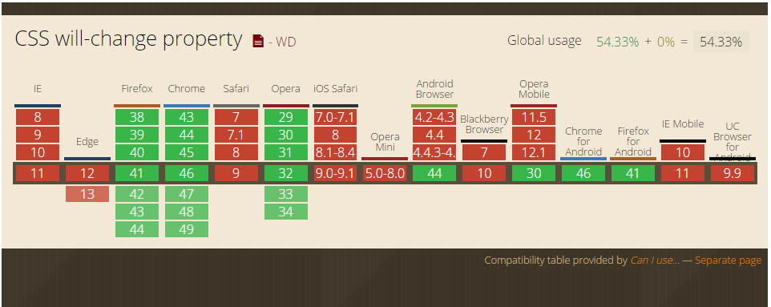

# CSS3 will-change

CSS3 will-change 属于 web 标准属性，虽然目前还是草案阶段，但出现已经有些时日了，兼容性这块 Chrome/Firefox/Opera 都是支持的。



这个属性作用很单纯，就是“增强页面渲染性能”。该属性语法如下：

```css
/* 关键字值 */
will-change: auto;
will-change: scroll-position;
will-change: contents;
will-change: transform; /* <custom-ident>示例 */
will-change: opacity; /* <custom-ident>示例 */
will-change: left, top; /* 两个 <animateable-feature> 示例 */
/* 全局值 */
will-change: inherit;
will-change: initial;
will-change: unset;
```

其中：

- `auto` 重置其他值
- `scroll-position` 翻滚
- `contents` 内容要动画或变化
- `<custom-ident>` 自定义属性，可以是 CSS3 动画常用属性，但不能是以下这些关键字值：`unset`, `initial`, `inherit`, `will-change`, `auto`, `scroll-position`, 或 `contents`。
- `<animateable-feature>` 可动画的一些特征值，比方说 `left`, `top`, `margin` 之类。

就目前而言，使用的基本上都是：

```css
.example {
  will-change: transform;
}
```

`will-change` 虽然可以加速，但是，一定一定要适度使用。那种全局都开启 `will-change` 等待模式的做法，无疑是死路一条。

`will-change` 的使用要谨慎，遵循最小化影响原则。

不要这样直接写在默认状态中，因为 `will-change` 会一直挂着：

```css
.will-change {
  will-change: transform;
  transition: transform 0.3s;
}
.will-change:hover {
  transform: scale(1.5);
}
```

可以让父元素 `hover` 的时候，声明 `will-change`，这样，移出的时候就会自动 `remove`，触发的范围基本上是有效元素范围。

```css
.will-change-parent:hover .will-change {
  will-change: transform;
}
.will-change {
  transition: transform 0.3s;
}
.will-change:hover {
  transform: scale(1.5);
}
```

如果使用 JS 添加 `will-change`, 事件或动画完毕，一定要及时 `remove`。如下示例：

```js
dom.onmousedown = function () {
  target.style.willChange = 'transform';
};
dom.onclick = function () {
  // target 动画哔哩哔哩...
};
target.onanimationend = function () {
  // 动画结束回调，移除 will-change
  this.style.willChange = 'auto';
};
```
