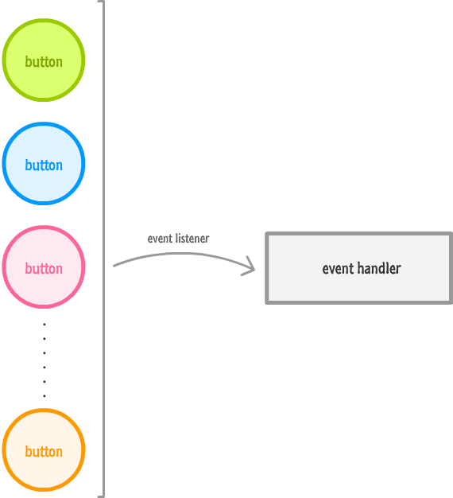

# React 中的事件

在 React 中，我们是通过在 JSX 中以内联（inline）的方式指定一切来监听一个事件。更特殊地，**是在标记内同时指定要监听的事件以及要调用的事件处理器**。

## 事件处理流程

### 常规事件处理
第一步，监听按钮上的点击事件。
```
return (
    <div style={backgroundStyle}>
        <Counter display={this.state.count} />
        <button onClick={this.increase} style={buttonStyle}>+</button>
    </div>
);
```

这里我们所做的是，告诉 React 在监听到 `onClick` 事件后，调用 `increase` 函数。

第二步，当点击事件被监听到时，指定处理该事件的事件处理器。
```
increase: function () {
    this.setState({
        count: this.state.count + 1
    });
}
```

`increase` 函数作为签名的事件处理器可以访问任何事件参数。


### Event 属性
我们知道，事件传递事件参数给事件处理器。这些事件参数包含了大量我们要处理的针对特定事件类型的属性。

在常规 DOM 中，每个事件都有自己的类型。例如，如果处理鼠标事件，那么事件和事件参数对象将是 `MouseEvent` 类型的。这个 `MouseEvent` 对象让我们访问鼠标相关的信息，比如哪个按钮被按下，或者鼠标点击的屏幕位置。与键盘相关的事件参数是 `KeyboardEvent` 类型的。`KeyboardEvent` 对象包含一些属性，这些属性让我们可以判断哪个键被按下。

### 合成事件
在 React 中，如果像在 `onClick` 中所做的那样在 JSX 中指定事件时，是不能直接处理常规的 DOM 事件的，而是处理 React 特定的事件类型 `SyntheticEvent`。你的事件处理器不能得到原生的事件参数类型 `MouseEvent`、`KeyboardEvent` 等等，而是总是得到封装了浏览器的原生事件的事件参数类型 `SyntheticEvent`。

每个 `SyntheticEvent` 包含如下属性：
```
boolean bubbles
boolean cancelable
DOMEventTarget currentTarget
boolean defaultPrevented
number eventPhase
boolean isTrusted
DOMEvent nativeEvent
void preventDefault()
boolean isDefaultPrevented()
void stopPropagation()
boolean isPropagationStopped()
DOMEventTarget target
number timeStamp
string type
```

这些属性看起来很简单，很通用。而不通用的部分取决于 `SyntheticEvent` 包含了什么类型的本地事件。这意味着一个包含了 `MouseEvent` 的 `SyntheticEvent` 可以访问像如下的这些鼠标相关的属性：
```
boolean altKey
number charCode
boolean ctrlKey
boolean getModifierState(key)
string key
number keyCode
string locale
number location
boolean metaKey
boolean repeat
boolean shiftKey
number which
```

最后，这一切意味着我们依然可以在 `SyntheticEvent` 中用在原生 DOM 世界具备的相同的功能。

**当使用合成事件及其属性时，不要参考传统 DOM 事件文档**。因为 `SyntheticEvent` 包含了原生 DOM 事件，事件及其属性并不一定是一对一映射的。有些 DOM 事件在 React 甚至是不存在的。要避免遇到任何问题，如果你想知道一个合成事件或者任何其属性，应该参考 [React 事件系统文档](https://facebook.github.io/react/docs/events.html)。


### 用事件属性干活
我们想做的是当用鼠标点击加号按钮同时按着 Shift 键，让计数器加十。

我们打算在用鼠标时，用 SyntheticEvent 的 shiftKey 属性完成这件事情：
```
boolean altKey
number button
number buttons
number clientX
number clientY
boolean ctrlKey
boolean getModifierState(key)
boolean metaKey
number pageX
number pageY
DOMEventTarget relatedTarget
number screenX
number screenY
boolean shiftKey
```

这个属性的工作方式很简单。当鼠标事件触发时，如果 `Shift` 键被按下，那么 `shiftKey` 属性的值为 `true`，否则为 `false`。

在 Shift 键被按下时，要让计数器加十，请回到 increase 函数，作出如下高亮度行的修改：
```
increase: function (e) {
    var currentCount = this.state.count;

    if (e.shiftKey) {
        currentCount += 10;
    } else {
        currentCount += 1;
    }

    this.setState({
        count: currentCount
    });
}
```

每次点击加号按钮，计数器就会加一。如果点击加号按钮，同时按住 `Shift` 键，计数器就会加十。

这一切能够运行的原因是我们根据 `Shift` 键是否被按下，修改了增加的行为。这主要是通过如下行来处理的：
```
if (e.shiftKey) {
    currentCount += 10;
} else {
    currentCount += 1;
}
```

如果 `SyntheticEvent` 事件参数上的 `shiftKey` 属性为 `true`，那么计数器就增加 `10`。如果 `shiftKey` 的值为 `false`，那么就只加 `1`。


## 更多事件技巧
真实的应用将是更复杂，并且因为 React 坚持独立特行。


### 不能直接在组件上监听事件
直接在组件上注册事件：
```
<Button onClick={this.increase} />
```

表面上看，这行 JSX 是完全有效的。

**你只是不能直接在组件上监听事件**。原因是，组件是 DOM 元素的包装器。要监听一个组件上的事件到底是什么意思？一旦组件被展开到 DOM 元素中，你要监听的事件是放到外层 HTML 元素上吗？它是一些其它元素吗？在监听一个事件与声明你要监听的一个 prop 之间你如何区分？

变通方案是将事件处理器当作是一个 `prop`，并将它传递给组件。然后在组件内，我们可以把事件赋值给一个 DOM 元素，并将事件处理器设置为我们刚传进来的 `prop` 的值。处理方式如下：
```
# 第一步
<Button clickHandler={this.increase} />

# 第二步
var Button = React.createClass({
    render: function () {
        return (
            <button onClick={this.props.clickHandler} className="btn">+</button>
        )
    }
});
```

在 `button` 元素上，我们指定了 `onClick` 事件，并将它的值设置为 `clickHandler prop`。在运行时，这个 `prop` 被求值为 `increase` 函数，并且点击加号按钮确保 `increase` 函数被调用。


### 监听常规 DOM 事件
并非所有的 DOM 事件都有 `SyntheticEvent` 的等价物。看起来当在 JSX 中在行内指定事件时，好像你只要添加一个 `on` 前缀，并且把要监听的事件首字母大写就可以了：
```
var Something = React.createClass({
    handleMyEvent: function(e) {
        // do something
    },
    render: function() {
        return (
            <div myWeirdEvent={this.handleMyEvent}>Hello!</div>
        );
    }
});
```

但是这样行不通！对于那些 React 官方不能识别的事件，你必须用传统的 `addEventListener`， 加上一些额外的手段。

看看如下的代码：
```
var Something = React.createClass({
    handleMyEvent: function(e) {
        // do something
    },
    componentDidMount: function() {
        window.addEventListener("someEvent", this.handleMyEvent);
    },
    componentWillUnmount: function() {
        window.removeEventListener("someEvent", this.handleMyEvent);
    },
    render: function() {
        return (
            <div>Hello!</div>
        );
    }
});
```

这里我们的 `Something` 组件要监听一个 `someEvent` 事件。我们在 `componentDidMount` 方法下开始监听该事件，我们知道该方法是在组件被渲染时自动调用的。监听该事件的方式是，用 `addEventListener`，并同时指定事件和要调用的事件处理器：
```
var Something = React.createClass({
    handleMyEvent: function(e) {
        // do something
    },
    componentDidMount: function() {
        window.addEventListener("someEvent", this.handleMyEvent);
    },
    componentWillUnmount: function() {
        window.removeEventListener("someEvent", this.handleMyEvent);
    },
    render: function() {
        return (
            <div>Hello!</div>
        );
    }
});
```

这应该是很简单。

唯一要记住的事情是，当组件要被销毁时，要移除事件监听器。为此，你可以用 `componentDidMount` 相反的方法 `componentWillUnmount` 方法。在该方法内，放上 `removeEventListener` 调用，以确保在组件消失后该事件监听的痕迹也消失。


### 事件处理器中 this 的含义
当在 React 中处理事件时，事件处理器中 `this` 的值，与非 React 的 DOM 世界中常看到的，是不同的。在非 React 的世界中，事件处理器中 this 的值引用的是触发该事件的元素：
```
function doSomething(e) {
    console.log(this); //button element
}

var button = document.querySelector("button");
button.addEventListener("click", doSomething, false);
```

在 React 世界中（即组件是用 `React.createClass` 创建的），事件处理器中的 `this` 引用的总是事件处理器所处的组件：
```
var CounterParent = React.createClass({
    getInitialState: function() {
        return {
            count: 0
        };
    },
    increase: function(e) {
        console.log(this); // CounterParent component

        this.setState({
            count: this.state.count + 1
        });
    },
    render: function() {
        return (
            <div>
                <Counter display={this.state.count}/>
                <button onClick={this.increase}>+</button>
            </div>
        );
    }
});
```

在本例中，`increase` 事件处理器中 this 的值为 `CounterParent` 组件，而不是触发该事件的元素。这是因为 React 自动绑定一个组件中所有的方法给 `this`。这种自动绑定的行为只适用于当组件是用 `React.createClass` 创建时。如果用 ES6 的类来定义组件，那么事件处理器中 `this` 的值就是 `undefined`，除非你自己显式绑定它：
```
<button onClick={this.increase.bind(this)}>+</button>
```

ES6 中自动绑定是不会发生的，所以如果你不用 `React.createClass` 创建组件，必须记住这点。


## React...为什么？为什么？！
React 决定背离我们过去处理事件的方式，有两个原因：

* 浏览器兼容性
* 性能提升

### 1.浏览器兼容性
事件处理在现代浏览器中是可以一致工作的事情之一，但是如果回到旧的浏览器版本，事情就会马上变得很糟糕。通过将所有本地事件封装为一个 `SyntheticEvent` 类型的对象，React 让我们从处理最终不得不处理的事件处理怪癖中解脱出来。

### 2.性能提升
在复杂的 UI 中，事件处理器越多，应用程序占用的内存就越多。

React 从不会将事件处理器直接绑定到 DOM 元素。它在文档的根部使用一个事件处理器，来负责监听所有事件，并按需调用合适的事件处理器：



这就将你从不得不自己处理优化事件处理器相关代码中解脱出来。如果过去你不得不手动干这事，那么你可以宽心地知道 React 为你搞定这些枯燥的任务。
