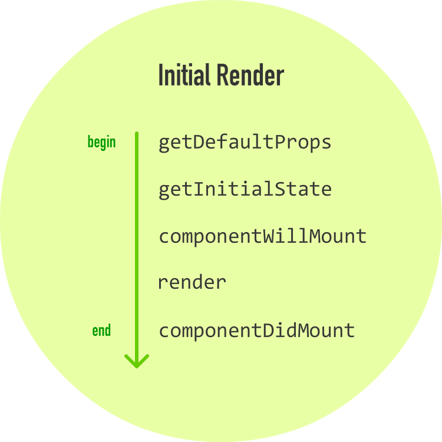
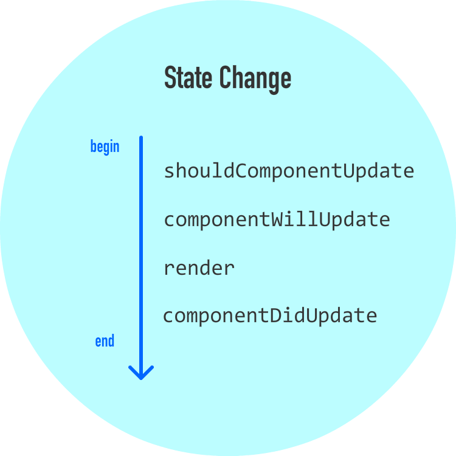
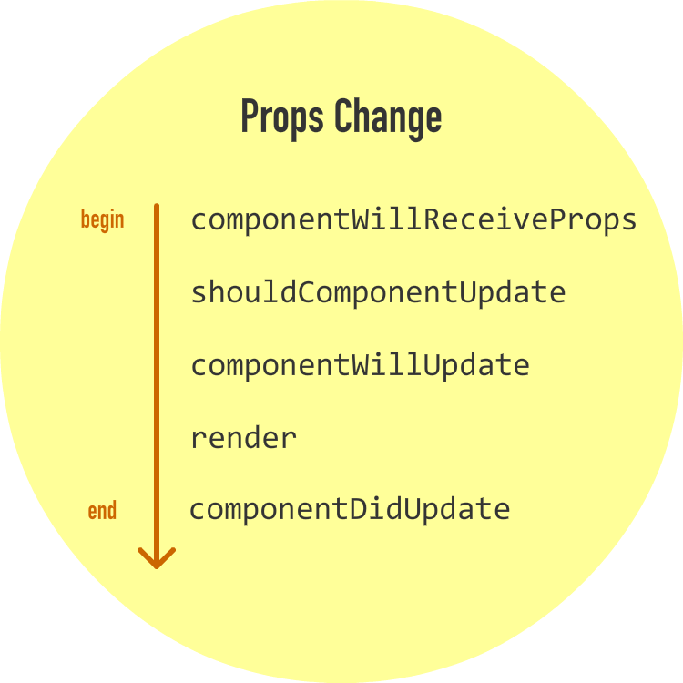
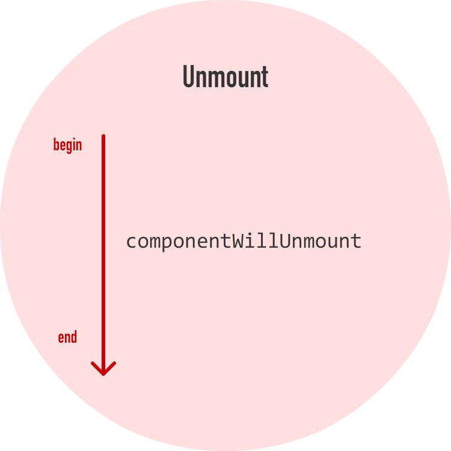

# React 生命周期

React 给我们提供了一些生命周期方法。

生命周期方法是组件正常运转时自动调用的特殊方法，它们告知我们组件生命中重要的里程碑，我们可以用这些通知来只是注意，或者改变组件要做的事情。

## 初识生命周期方法

生命周期方法不是很复杂。

我们可以把它们当作是在组件生命中的不同的点被调用的美化的事件处理器，并且就像事件处理器一样，我们可以在这些不同的点编写代码做一些事情。

在深入之前，我们先来快速了解一下生命周期方法。它们是 `componentWillMount`, `componentDidMount`, `componentWillUnmount`, `componentWillUpdate`, `componentDidUpdate`, `shouldComponentUpdate`, `componentWillReceiveProps`。 还有三个方法严格上讲并非生命周期方法，但是我们仍要把它们跟生命周期方法混在一起，它们是 `getInitialState`、`getDefaultProps` 和 `render`。

```
# 获取初始状态
getDefaultProps: function(){
    console.log("getDefaultProps: Default prop time!");
    return {};
}

# 初始化状态
getInitialState: function() {
    console.log("getInitialState: Default state time!");
    return {
        count: 0
    };
}

# 组件将要更新
componentWillUpdate: function(newProps, newState) {
    console.log("componentWillUpdate: Component is about to update!");
}

# 组件刚刚被更新
componentDidUpdate: function(currentProps, currentState) {
    console.log("componentDidUpdate: Component just updated!");
}

# 组件将要被加载
componentWillMount: function() {
    console.log("componentWillMount: Component is about to mount!");
}

# 组件刚刚被加载
componentDidMount: function() {
    console.log("componentDidMount: Component just mounted!");
}

# 组件即将被卸载
componentWillUnmount: function() {
    console.log("componentWillUnmount: Component is about to be removed from the DOM!");
}

# 是否要更新组件
shouldComponentUpdate: function(newProps, newState) {
    console.log("shouldComponentUpdate: Should component update?");

    if (newState.count < 5) {
        console.log("shouldComponentUpdate: Component should update!");
        return true;
    } else {
        ReactDOM.unmountComponentAtNode(document.querySelector('#container'));
        console.log("shouldComponentUpdate: Component should not update!");
        return false;
    }
}

# 组件要更新属性
componentWillReceiveProps: function(newProps){
    console.log("componentWillReceiveProps: Component will get new props!");
}
```

## 初始渲染阶段

当组件准备开始其生命，进入 DOM 时，如下的生命周期方法被调用：



现在我们继续深入学习每个生命周期方法：

* `getDefaultProps` - 该方法允许我们指定 `this.props` 的默认值，它在组件被创建或者父组件的任何属性传递进来之前被调用；

* `getInitialState` - 本方法允许我们指定在组件被创建前 `this.state` 的默认值，与 '`getDefaultProps' 方法一样，它也是在组件被创建前被调用；

* `componentWillMount` - 这是组件被渲染到 DOM 之前被调用的最后一个方法，一个需要指出的重要事情是：如果在这个方法中调用 `setState`，那么组件是不会被重新渲染；

* `render` - 每个组件必须定义有这个方法，它负责返回单个根 HTML 节点（该节点内部可以有很多字节点），如果我们不想渲染任何东西，让它返回 null 或者 false 即可；

* `componentDidMount` - 组件渲染并且放到 DOM 后，该方法会立即被调用。在这个点上，我们可以安全的执行任何 DOM 查询操作，而不用担心组件是否被创建。如果有代码依赖于组件是否准备好了，那么你也可以在这里指定所有代码。

除了 `render` 方法外，所有这些生命周期方法只能触发一次。

## 更新阶段

在组件添加到 DOM 之后，当属性或者状态发生更改时，组件可能会更新。在此期间，会有一些生命周期方法被调用。

### 处理状态改变

当状态改变发生时，前面我们提到组件会再次调用其 render 方法。任何依赖于该组件的输出的组件的 `render` 方法也会被调用。这样做就可以确保组件总是显示最新版本的自己。

当状态发生改变时，如下生命周期方法被调用：



这些生命周期方法要做的事情如下：

**`shouldComponentUpdate`** - 有时，当一个状态发生改变时，你不想让组件更新，这个方法可以让我们控制更新行为。如果你使用该方法，并返回一个 `true` 值，组件就会被更新；如果返回一个 `false` 值，该组件就不会更新。

```
shouldComponentUpdate: function(newProps, newState) {
    console.log("shouldComponentUpdate: Should component update?");

    if (newState.count < 5) {
        console.log("shouldComponentUpdate: Component should update!");
        return true;
    } else {
        ReactDOM.unmountComponentAtNode(document.querySelector('#container'));
        console.log("shouldComponentUpdate: Component should not update!");
        return false;
    }
}
```

该方法带有两个参数：`newProps` 和 `newState`。

上面的代码片段用来判断 `count` 状态属性的新值是否小于 `5`。如果是，那么返回 true，指示该组件要更新；如果不是，那么返回 `false`，指示组件不更新。

**`componentWillUpdate`** - 该方法在组件将要被更新之前被调用。有一件事情要指出的是，不能在这个方法中通过调用 this.setState 来修改状态。

**`render`** - 如果没有通过 `shouldComponentUpdate` 忽略更新，那么 `render` 中的代码会再次被调用，以确保组件正确显示自己。

**`componentDidUpdate`** - 该方法在组件更新以及 `render` 方法被调用过后被调用。如果你要在更新发生后执行一些代码，那么就应该把代码放在这个方法中。

### 处理 prop 改变

组件更新的另一个时间是，当组件已经被渲染到 DOM 以后，其 `prop` 值发生改变时。在这种情况下，如下的生命周期方法被调用：



这里唯一的新方法是 `componentWillReceiveProps`，该方法只返回一个参数，并且该参数包含将要赋值的新 `prop` 值。

## 卸载阶段

最后一个阶段是当组件要销毁，并从 DOM 中删除时：



这里唯一的生命周期方法是 `componentWillUnmount`。

我们可以在这个方法中执行清理相关的任务，比如移除事件监听器、停止计数器等等。在该方法被调用后，组件就从 DOM 中移除。
