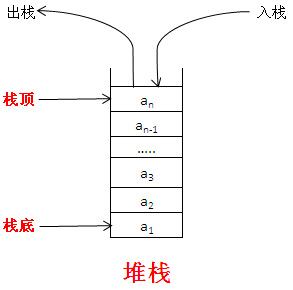
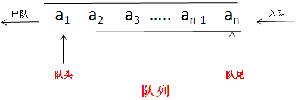
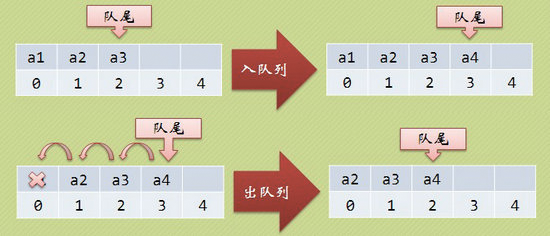
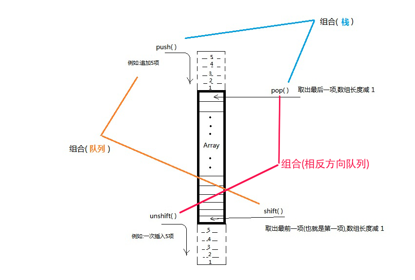

数组操作
===

JavaScript 的数组是一个拥有堆栈和队列自身优点的 `global` 对象，它可以表现的像栈(`LIFO`)和队列(`FIFO`)一样操作。

## 堆栈和队列

栈和队列都是动态的集合。

在栈中，可以去掉的元素是最近插入的那一个，栈实现了后进先出。在队列中，可以去掉的元素总是在集合中存在的时间最长的那一个，队列实现了先进先出的策略。

### 堆栈

栈是一种 LIFO（`Last-In-First-Out`，后进先出）的数据结构，也就是最新添加的项最早被移除。而栈中项的插入（叫做推入）和移除（叫做弹出），只发生在一个位置——栈的顶部。

最开始栈中不含有任何数据，叫做空栈，此时栈顶就是栈底。然后数据从栈顶进入，栈顶栈底分离，整个栈的当前容量变大。数据出栈时从栈顶弹出，栈顶下移，整个栈的当前容量变小。如下图示意：



比如说，我们在一个箱子中放了很多本书，如果你要拿出第二书，那么你要先把第一本书拿出来，才能拿第二本书出来；拿出第二本书之后，再把第一本书放进去。

ECMAScript 为数组专门提供了 `push()` 和 `pop()` 方法，以便实现类似栈的行为。`push()` 方法可以接收任意数量的参数，把它们逐个添加到数组末尾，并返回修改后数组的长度。而 `pop()` 方法则从数组末尾移除最后一项，减少数组的 `length` 值，然后返回移除的项。

### 队列

队列数据结构的访问规则是FIFO(Fist-In-First-Out,先进先出)，队列在列表的末端添加项，从列表的前端移除项。如下图所示：



比如说火车站排队买票，先到的先买，买好的先走。

入队列操作其实就是在队尾追加一个元素，不需要任何移动，时间复杂度为 `O`(`1`)。出队列则不同，因为我们已经架设下标为0的位置是队列的队头，因此每次出队列操作所有元素都要向前移动。如下图所示：



ECMAScript 为数组专门提供了 `shift()` 和 `unshift()` 方法，以便实现类似队列的行为。由于 `push()` 是向数组末端添加数组项的方法，因此要模拟队列只需一个从数组前端取得数组项的方法。实现这一操作的数组方法就是 `shift()`，它能够移除数组中的第一个项并返回该项，同时将数组长度减 1。

顾名思义， `unshift()` 与 `shift()` 的用途相反：它能在数组前端添加任意个数组项并返回新数组的长度。因此，同时使用 `unshift()` 和 `pop()` 方法，可以从相反的方向来模拟队列，即在数组的前端添加数组项，从数组末端移除数组项。

## push() 方法

该方法是向数组末尾添加一个或者多个元素，并返回新的长度。

`push()` 方法可以接收任意数量的参数，把它们逐个添加到数组的末尾，并返回修改后数组的长度。

## pop() 方法

`pop()` 方法刚好和 `push()` 方法相反。

`pop()` 方法删除数组的最后一个元素，把数组的长度减 `1`，并且返回它被删除元素的值，如果数组变为空，则该方法不改变数组，返回 `undefine` 值。

## unshift() 方法

`unshift()` 方法是向数组的开头添加一个或多个元素，并且返回新的长度。

## shift() 方法

`shift()` 方法和 `unshift()` 方法恰恰相反。该方法用于把数组的第一个元素从其中删除，并返回被删除的值。如果数组是空的，`shift()` 方法将不进行任何操作，返回 `undefined` 的值。

将以上几种方法组合起来，可以轻松的实现堆栈和队列的行为。



## push() 方法和 unshift() 方法的性能测试

Array 的 `push()` 与 `unshift()` 方法都能给当前数组添加元素，不同的是，`push()` 是在末尾添加，而 `unshift()` 则是在开头添加，从原理就可以知道，`unshift()` 的效率是较低的。原因是，它每添加一个元素，都要把现有元素往下移一个位置。

```js
var arr = [];
var startTime = +new Date(); // +new Date()相当于new Date().valueOf()，返回当前时间的毫秒数
// push性能测试
for (var i = 0; i < 100000; i++) {　　
    arr.push(i);
}
var endTime = +new Date();
console.log("调用push方法往数组中添加100000个元素耗时" + (endTime - startTime) + "毫秒");

startTime = +new Date();
arr = [];
// unshift性能测试
for (var i = 0; i < 100000; i++) {　　
    arr.unshift(i);
}
endTime = +new Date();
console.log("调用unshift方法往数组中添加100000个元素耗时" + (endTime - startTime) + "毫秒");
```

在 Chrome 的 console 下运行，输出结果如下：

```bash
调用push方法往数组中添加100000个元素耗时5毫秒
调用unshift方法往数组中添加100000个元素耗时4030毫秒
```

可见，`unshift()` 比 `push()` 要慢差不多 `1000` 倍!因此，平时还是要慎用 `unshift()`，特别是对大数组。

如果一定要达到 `unshift()` 的效果，可以借助于 Array 的 `reverse()` 方法，它能够把一个数组反转。先把要放进数组的元素用 `push()` 添加，再执行一次 `reverse()`，就达到了 `unshift()` 的效果。
