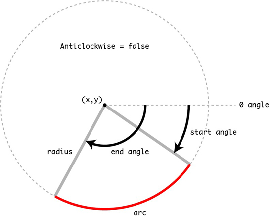
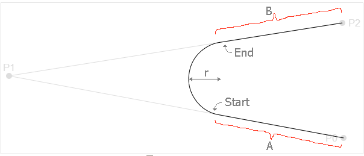
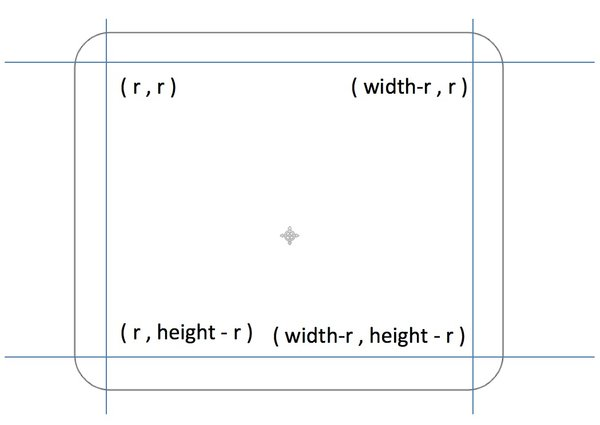

Canvas 绘制圆和圆弧
===

在 Canvas 中，`CanvasRenderingContext2D` 对象提供了两个方法（`arc()` 和 `arcTo()` ）来绘制圆和圆弧。

## `arc()` 方法

`arc()` 方法接受六个参数：

```js
ctx.arc(x, y, radius, startRad, endRad, [anticlockwise]);
```

在 Canvas 画布上绘制以坐标点 `(x,y)` 为圆心、半径为 `radius` 的圆上的一段弧线。这段弧线的起始弧度是 `startRad`，结束弧度是 `endRad`。这里的弧度是以 `x` 轴正方向为基准、进行顺时针旋转的角度来计算。其中 `anticlockwise` 表示 `arc()` 绘制圆或圆弧是以顺时针还是逆时针方向开始绘制。如果其值为 `true` 表示逆时针，如果是 `false` 表示为顺时针。该参数是一个可选参数，如果没有显式设置，其值是 `false`（也是 `anticlockwise` 的默认值）。



## 绘制弧线

我们来绘制一个圆弧：

```js
function drawScreen() {
    // x,y => 圆心坐标点 
    // r => 圆弧半径 
    var arc = {
            x: myCanvas.width / 2,
            y: myCanvas.height / 2,
            r: 100
        },
        w = myCanvas.width,
        h = myCanvas.height;

    ctx.save();
    ctx.lineWidth = 10;
    ctx.strokeStyle = '#e3f';

    // startRad => getRads(-45) 
    // endRad => getRads(45) 
    // 顺时针旋转 
    ctx.beginPath();
    ctx.arc(arc.x, arc.y, arc.r, getRads(-45), getRads(45));
    ctx.stroke();

    // startRad => getRads(-135) 
    // endRad => getRads(135) 
    // 逆时针旋转 
    ctx.beginPath();
    ctx.strokeStyle = "#f36";
    ctx.arc(arc.x, arc.y, arc.r, getRads(-135), getRads(135), true);
    ctx.stroke();
    ctx.restore();
}
```

[Canvas 圆弧](https://jsfiddle.net/guihua/jza06tk7/)

把上面案例中的 `stroke()` 方法换成 `fill()`，我们会发现圆弧被填充了：[Canvas 圆弧填充](https://jsfiddle.net/guihua/jza06tk7/1/)

另外在 `stroke()` 之前调用 `closePath()` ，那么弧线的起始点和终止点将会以一条直接连接在一起：[Canvas 圆弧闭合](https://jsfiddle.net/guihua/jza06tk7/2/)

下面，我们借助一些循环条件，来实现一个声波效果：

```js
function drawScreen() {
    var arc = {
            x: myCanvas.width / 2,
            y: myCanvas.height / 2,
            r: 10
        },
        w = myCanvas.width,
        h = myCanvas.height;

    ctx.save();
    ctx.lineWidth = 1;
    ctx.strokeStyle = '#e3f';

    for (var i = 0; i < 10; i++) {
        ctx.beginPath();
        ctx.arc(arc.x, arc.y, arc.r * i, getRads(-45), getRads(45));
        ctx.stroke();
        
        ctx.beginPath();
        ctx.arc(arc.x, arc.y, arc.r * i, getRads(-135), getRads(135), true);
        ctx.stroke();
    }
}
```

[canvas 声波效果](https://jsfiddle.net/guihua/g8ygoze7/)

特别注意：

- 使用 `arc()` 绘制图形时，如果没有设置 `moveTo()` 那么会从圆弧的开始的点（`startRad` 处）作为起始点。如果设置了 `moveTo()`，那么该点会连线到圆弧起始点。
- 如果使用 `stroke()` 方法，那么会从开始连线到圆弧的起始位置。 如果是 `fill` 方法, 会自动闭合路径填充

## 绘制圆

使用 `arc` 绘制圆和绘制圆弧是一样的，只不过绘制圆的时候 `startRad` 和 `endRad` 是相同的。

```js
function drawScreen() {
    var arc = {
            x: myCanvas.width / 2,
            y: myCanvas.height / 2,
            r: 50
        },
        w = myCanvas.width,
        h = myCanvas.height;
        
    ctx.save();
    ctx.lineWidth = 2;
    ctx.strokeStyle = '#fff';
    ctx.fillStyle = '#000';

    // 绘制一个边框圆 
    ctx.beginPath();
    ctx.arc(arc.x / 2, arc.y, arc.r, getRads(0), getRads(360), false);
    ctx.stroke();

    // 绘制一个闭合边框圆 
    ctx.beginPath();
    ctx.arc(arc.x, arc.y, arc.r, getRads(0), getRads(360), false);
    ctx.closePath();
    ctx.stroke();

    // 绘制一个填充圆 
    ctx.beginPath();
    ctx.arc(arc.x * 1.5, arc.y, arc.r, getRads(0), getRads(360), true);
    ctx.fill();

    //绘制一个带边框填充的圆 
    ctx.beginPath();
    ctx.arc(arc.x, arc.y, arc.r / 2, getRads(0), getRads(360), false);
    ctx.stroke();
    ctx.fill();
    ctx.restore();
}
```

[Canvas 绘制圆](https://jsfiddle.net/guihua/27gsk2mx/)

接下来，我们用 Canvas 实现一个太极图。

第一步，绘制两个大半圆，采用相同的起点和半径，两个大半圆组成一个完整的圆：

```js
// 绘制白色大圆 
ctx.beginPath();
ctx.fillStyle = '#fff';
ctx.arc(arc.x, arc.y, arc.r, getRads(-90), getRads(90), false);
ctx.fill();

// 绘制黑色大圆 
ctx.beginPath();
ctx.fillStyle = '#000';
ctx.arc(arc.x, arc.y, arc.r, getRads(-90), getRads(90), true);
ctx.fill();
```

第二步，在两个半圆中分别绘制颜色相反的小半圆：

```js
// 绘制白色小圆 
ctx.beginPath();
ctx.fillStyle = '#fff';
ctx.arc(arc.x, arc.y - arc.r / 2, arc.r / 2, getRads(-90), getRads(90), true);
ctx.fill();

// 绘制黑色小圆 
ctx.beginPath();
ctx.fillStyle = '#000';
ctx.arc(arc.x, arc.y + arc.r / 2, arc.r / 2, getRads(-90), getRads(90), false);
ctx.fill();
```

此时，就差两个太极图的两个眼睛了。

最后，加上龙眼：

```js
// 绘制小黑点 
ctx.beginPath();
ctx.fillStyle = '#000';
ctx.arc(arc.x, arc.y - arc.r / 2, arc.r / 10, getRads(0), getRads(360), false);
ctx.fill();

// 绘制小白点 
ctx.beginPath();
ctx.fillStyle = '#fff';
ctx.arc(arc.x, arc.y + arc.r / 2, arc.r / 10, getRads(0), getRads(360), false);
ctx.fill();
```

到此，完整的太极图实现了：[Canvas 绘制太极图](https://jsfiddle.net/guihua/6x33squh/)

## 绘制扇形

使用 `arc()` 除了可以绘制弧线和圆之外，还可以绘制扇形。绘制扇形关键点是通过 `moveTo()` 把起始点位置设置为圆心处，然后通过 `closePath()` 闭合路径。

```js
function drawScreen() {
    var arc = {
            x: myCanvas.width / 2,
            y: myCanvas.height / 2,
            r: 100
        },
        w = myCanvas.width,
        h = myCanvas.height;

    ctx.save();
    ctx.lineWidth = 1;
    ctx.strokeStyle = '#e3f';
    ctx.fillStyle = '#e3f';

    ctx.beginPath();
    // 起始点设置在圆心处 
    ctx.moveTo(arc.x, arc.y);
    ctx.arc(arc.x, arc.y, arc.r, getRads(-45), getRads(45));
    // 闭合路径 
    ctx.closePath();
    ctx.stroke();
    
    ctx.beginPath();
    // 起始点设置在圆心处 
    ctx.moveTo(arc.x, arc.y);
    ctx.arc(arc.x, arc.y, arc.r, getRads(-135), getRads(135), true);
    // 闭合路径 ctx.closePath(); 
    ctx.fill();
    ctx.restore();
}
```

[Canvas 绘制扇形](https://jsfiddle.net/guihua/kf3dxdcm/)

## `arcTo()` 方法

在 Canvas 中 `CanvasRenderingContext2D` 还提供了另一个方法 `arcTo()` 用来绘制弧线，但 `arcTo()` 绘制不出圆。

`arcTo()` 接受五个参数：

```
ctx.arcTo(x1, y1, x2, y2, radius);
```

`arcTo()` 方法将利用当前端点、端点一 `(x1, y1)` 和端点二 `(x2, y2)` 这三点所形成的夹角，然后绘制一段与夹角的两边相切并且半径为 `radius` 的圆上的弧线。弧线的起点就是当前端点所在边与圆的切点，弧线的终点就是端点二 `(x2,y2)` 所在边与圆的切点，并且绘制的弧线是两个切点之间长度最短的那个圆弧。此外，如果当前端点不是弧线起点，`arcTo()` 方法还将添加一条当前端点到弧线起点的直线线段。



在 `arcTo()` 函数中，虽然参数只涉及到 `P1` 也就是参数中的 `(x1,y1)` 和 `P2` 也就是参数中的 `(x2,y2)` 两个点，实际上还有一个隐含的点，就是画布上的当前点（`P0`）也就是前面所说的 `(x0,y0)`。当 `P0`, `P1`, `P2` 不重叠也不在一条直线的时候，这 `3` 个点可以构成一个三角形。想象一下，从 `P0` 开始，向 `P1` 画一条线段，从 `P1` 开始到 `P2` 再画一条线段，这两条线段形成一个夹角，然后以 `r` 画一个圆，移动这个圆将这个圆与线段 `P0P1` 和线段 `P1P2` 相切（也可能切点是在 `P0P1` 或者 `P1P2` 的延长线上），然后保留朝向 `P1` 这个点的弧线，就是 `arcTo()` 在弧线这部分做的事情。

来看绘制过程：

```js
function drawScreen() {
    ctx.lineWidth = 1;
    ctx.strokeStyle = '#f36';
    ctx.fillStyle = 'red';

    // 一个起始点 ( 100, 50 ), 那么绘制其点. 颜色设置为红色 
    ctx.fillRect(100 - 4, 50 - 4, 8, 8);
    // 两个参考点分别为 ( 100, 200 ) 和 ( 300, 200 ), 绘制出该点 
    ctx.fillRect(100 - 4, 200 - 4, 8, 8);
    ctx.fillRect(300 - 4, 200 - 4, 8, 8);

    // 连接两个参考点 
    ctx.beginPath();
    ctx.strokeStyle = 'red';
    ctx.moveTo(100, 200);
    ctx.lineTo(300, 200);
    ctx.stroke();

    // 调用 arcTo 方法绘制圆弧. 记得将起始点设置为 ( 100, 50 ) 
    ctx.beginPath();
    ctx.strokeStyle = 'blue';
    ctx.moveTo(100, 50);
    ctx.arcTo(100, 200, 300, 200, 80);
    ctx.stroke();
}
```

[Canvas arcTo 绘制弧线](https://jsfiddle.net/guihua/90jfhL7s/)

## 绘制带圆角矩形

在 `arcTo()` 方法之前，我们通过 `lineJoin()` 改变线段端点形状来模拟一个圆角矩形。通过这样的方法绘制带圆角的矩形，局限性很大。接下来，我们来绘制一个带圆角的矩形。

圆角矩形是由四段线条和四个1/4圆弧组成，拆解如下：



如此一来，我们就可以封装一个函数，用来绘制圆角矩形。根据上图，我们可以给这个函数，比如 `drawRoundedRect()` 函数传递对应的参数：

- `ctx`：Canvas 画布绘图环境
- `x,y`：左上角
- `width`：矩形宽度
- `height`：矩形高度
- `r`：矩形圆角半径
- `fill`：绘制一个填充的矩形
- `stroke`：绘制一个边框矩形

开始封装函数：

```js
function drawRoundedRect(ctx, x, y, width, height, r, fill, stroke) {
    ctx.save();
    ctx.beginPath();

    // draw top and top right corner 
    ctx.moveTo(x + r, y);
    ctx.arcTo(x + width, y, x + width, y + r, r);

    // draw right side and bottom right corner 
    ctx.arcTo(x + width, y + height, x + width - r, y + height, r);

    // draw bottom and bottom left corner 
    ctx.arcTo(x, y + height, x, y + height - r, r);

    // draw left and top left corner 
    ctx.arcTo(x, y, x + r, y, r);

    if (fill) {
        ctx.fill();
    }

    if (stroke) {
        ctx.stroke();
    }
    
    ctx.restore();
}
```

调用该封装方法，即可绘制出带圆角的矩形：

```js
function drawScreen() {
    ctx.strokeStyle = 'rgb(150,0,0)';
    ctx.fillStyle = 'rgb(0,150,0)';
    ctx.lineWidth = 7;
    drawRoundedRect(ctx, 30, 50, 200, 220, 20, true, true);
    
    ctx.strokeStyle = 'rgb(150,0,150)';
    ctx.fillStyle = 'rgba(0,0,150,0.6)';
    ctx.lineWidth = 7;
    drawRoundedRect(ctx, 300, 100, 250, 150, 8, true, false);
}
```

[Canvas 实现圆角矩形](https://jsfiddle.net/guihua/hkh9c0x9/)
