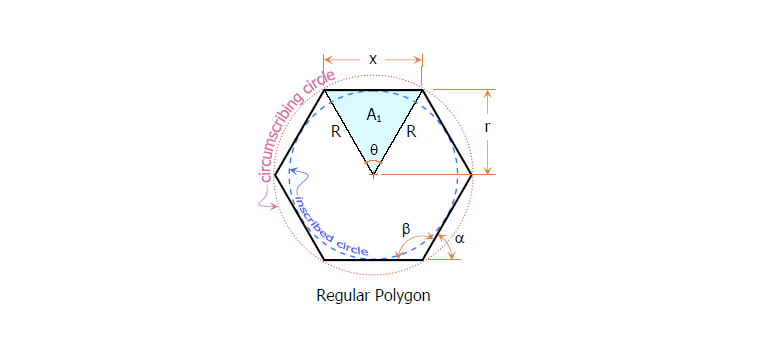

Canvas 绘制多边形
===

维基百科是这样描述的：**正多边形是所有角都相等、并且所有边都相等的简单多边形，简单多边形是指在任何位置都不与自身相交的多边形。**

正 `n` 边形每个内角为 `(1 - 2 / n) * 180` 或者表示为 `(n - 2) * 180 / n` 角度。也可以用弧度表示为 `(n - 2) * π / n` 或者 `(n - 2) / 2n`。



上图描述了正多边形的相关属性：

- 正多边形的中心点正好是一个正多边形的外接圆的圆心
- 正多边形每条边的长度都相等，如上图中的 `x`
- 正多边形的每个内角都相等，如上图中的 `β`
- 正多边形的每个外角都相等，如上图中的 `α`
- 正多边形的中心角都相等，如上图中的 `θ`
- 正多边形的中心点距正多边形的内切圆的半行为 `r`
- 正多边形的顶点数和边数相等，常用 `n` 表示
- 正多边形中心距正多边形的外接圆（或者正多边中心点距正多边形的顶点）就是正多边形外接圆半么，如上图中的 `R`
- 正多边形中心点距和每条边的端点构成一个等腰三角形，如上图中的 A1。这个三角形的两条边长度相等，刚好是正多边形外接圆半径 `R`，而这个三角形的高，刚好是正多边形内切圆半径 `r`

绘制正多边形：

```js
function drawPolygons(ctx, num, radius) {
    ctx.clearRect(-w / 2, -h / 2, w, h);

    ctx.save();

    ctx.beginPath();
    ctx.moveTo(0, -radius);

    for (var i = 0; i < num; i++) {
        angle = (360 / num) * (i + 1) * Math.PI / 180;
        actAngle = angle - Math.PI / 2;

        x = Math.cos(actAngle) * radius;
        y = Math.sin(actAngle) * radius;

        ctx.lineTo(x, y);
    }

    ctx.closePath();
    ctx.fill();
    ctx.stroke();
}
```

[Canvas 绘制正多边形 1](https://codepen.io/airen/full/WpgWmw/)

```js
// @param {CanvasRenderingContext2D} ctx
// @param {Number} xCenter 中心坐标X点
// @param {Number} yCenter 中心坐标Y点
// @param {Number} radius 外圆半径
// @param {Number} sides 多边形边数
// @param {Number} alpha 角度 默认270度
// @param {Boolean} arc 是否显示外圆
function drawPolygons(ctx, xCenter, yCenter, radius, sides, alpha, arc) {
    var radAngle = Math.PI * 2 / sides;
    var radAlpha = (alpha != 'undefined') ? alpha * Math.PI / 180 : -Math.PI / 2;

    ctx.save();
    ctx.beginPath();

    var xPos = xCenter + Math.cos(radAlpha) * radius;
    var yPos = yCenter + Math.sin(radAlpha) * radius;

    ctx.moveTo(xPos, yPos);

    for (var i = 1; i <= sides; i++) {
        var rad = radAngle * i + radAlpha;
        var xPos = xCenter + Math.cos(rad) * radius;
        var yPos = yCenter + Math.sin(rad) * radius;
        ctx.lineTo(xPos, yPos);
    }

    ctx.closePath();
}

// 绘制填充的多边形
// @param {CanvasRenderingContext2D} ctx
// @param {Number} xCenter 中心点X坐标点
// @param {Number} yCenter 中心点Y坐标点
// @param {Number} radius 外圆半径
// @param {Number} sides 多边形边数
// @param {Number} alpha 角度 默认270度
// @param {Boolean} arc 是否显示外圆
function drawFillPolygon(ctx, xCenter, yCenter, radius, sides, alpha, arc) {
    drawPolygons(ctx, xCenter, yCenter, radius, sides, alpha, arc);
    ctx.fill();

    // 画外接圆
    if (arc) {
        ctx.beginPath();
        ctx.arc(xCenter, yCenter, radius, 0, 2 * Math.PI, true);
        ctx.stroke();
    }
}

// 绘制描边的多边形
// @param {CanvasRenderingContext2D} ctx
// @param {Number} xCenter 中心点X坐标点
// @param {Number} yCenter 中心点Y坐标点
// @param {Number} radius 外圆半径
// @param {Number} sides 多边形边数
// @param {Number} alpha 角度 默认270度
// @param {Boolean} arc 是否显示外圆
function drawStrokePolygon(ctx, xCenter, yCenter, radius, sides, alpha, arc) {
    drawPolygons(ctx, xCenter, yCenter, radius, sides, alpha, arc);
    ctx.stroke();

    // 画外接圆
    if (arc) {
        ctx.beginPath();
        ctx.arc(xCenter, yCenter, radius, 0, 2 * Math.PI, true);
        ctx.stroke();
    }
}
```

对上面的进行扩展：[Canvas 绘制正多边形 2](https://codepen.io/airen/full/YZJPBB/)

绘制星形：

```js
// @param {CanvasRenderingContext2D} ctx
// @param {Number} xCenter 中心坐标X点
// @param {Number} yCenter 中心坐标Y点
// @param {Number} radius 外圆半径
// @param {Number} sides 多边形边数
// @param {Number} sideIndent (0 ~ 1)
// @param {Number} alpha 角度 默认270度
// @param {Boolean} arc 是否显示外圆
function drawStarPolygons(ctx, xCenter, yCenter, radius, sides, sideIndent, alpha, arc) {

    var sideIndentRadius = radius * (sideIndent || 0.38);
    var radAngle = alpha ? alpha * Math.PI / 180 : -Math.PI / 2;
    var radAlpha = Math.PI * 2 / sides / 2;

    ctx.save();
    ctx.beginPath();

    var xPos = xCenter + Math.cos(radAngle) * radius;
    var yPos = yCenter + Math.sin(radAngle) * radius;

    ctx.moveTo(xPos, yPos);

    for (var i = 1; i <= sides * 2; i++) {
        var rad = radAlpha * i + radAngle;
        var len = (i % 2) ? sideIndentRadius : radius;
        var xPos = xCenter + Math.cos(rad) * len;
        var yPos = yCenter + Math.sin(rad) * len;

        ctx.lineTo(xPos, yPos);

    }

    ctx.closePath();
}

// 绘制填充的多边形
// @param {CanvasRenderingContext2D} ctx
// @param {Number} xCenter 中心点X坐标点
// @param {Number} yCenter 中心点Y坐标点
// @param {Number} radius 外圆半径
// @param {Number} sides 多边形边数
// @param {Number} sideIndent (0 ~ 1)
// @param {Number} alpha 角度 默认270度
// @param {Boolean} arc 是否显示外圆
function drawFillStarPolygon(ctx, xCenter, yCenter, radius, sides, sideIndent, alpha, arc) {
    drawStarPolygons(ctx, xCenter, yCenter, radius, sides, sideIndent, alpha, arc);
    ctx.fill();

    // 画外接圆
    if (arc) {
        ctx.beginPath();
        ctx.arc(xCenter, yCenter, radius, 0, 2 * Math.PI, true);
        ctx.arc(xCenter, yCenter, radius * sideIndent, 0, 2 * Math.PI, true);
        ctx.stroke();
    }
}

// 绘制描边的多边形
// @param {CanvasRenderingContext2D} ctx
// @param {Number} xCenter 中心点X坐标点
// @param {Number} yCenter 中心点Y坐标点
// @param {Number} radius 外圆半径
// @param {Number} sides 多边形边数
// @param {Number} sideIndent (0 ~ 1)
// @param {Number} alpha 角度 默认270度
// @param {Boolean} arc 是否显示外圆
function drawStrokeStarPolygon(ctx, xCenter, yCenter, radius, sides, sideIndent, alpha, arc) {
    drawStarPolygons(ctx, xCenter, yCenter, radius, sides, sideIndent, alpha, arc);
    ctx.stroke();

    // 画外接圆
    if (arc) {
        ctx.beginPath();
        ctx.arc(xCenter, yCenter, radius, 0, 2 * Math.PI, true);
        ctx.arc(xCenter, yCenter, radius * sideIndent, 0, 2 * Math.PI, true);
        ctx.stroke();
    }
}
```

[Canvas 绘制星形](https://codepen.io/airen/pen/zZmvrV)
