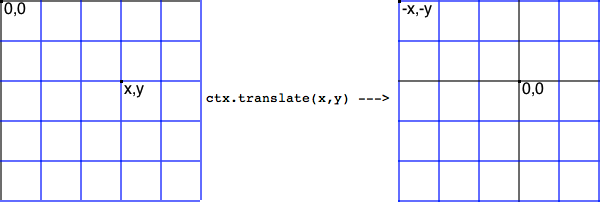
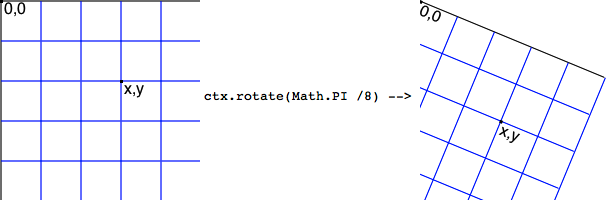
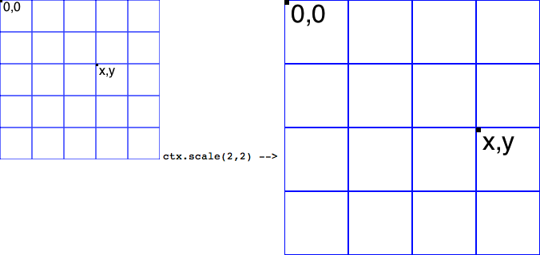

Canvas 坐标变换
===

## 移动 Translating

移动 Canvas 和它的原点到一个不同的位置：

```js
ctx.translate(x, y);
```

`translate` 方法接受两个参数。`x` 是左右偏移量，`y` 是上下偏移量。当偏移量操作出 Canvas 的 `width` 或 `height` 时，坐标将会移出 Canvas 的画布，这个时候你绘制的东西都将看不到。



```js
function drawGrid(ctx, w, h, stroke, steps) {
    ctx.save();
    ctx.beginPath();

    for (var i = 0.5; i < w; i += steps) {
        ctx.moveTo(i, 0);
        ctx.lineTo(i, h);
    }

    for (var i = 0.5; i < h; i += steps) {
        ctx.moveTo(0, i);
        ctx.lineTo(w, i);
    }
    
    ctx.strokeStyle = stroke;
    ctx.stroke();
    ctx.restore();
}
```

然后我们通过 `translate()` 方法来移动坐标系统：

```js
ctx.translate(40, 40);

drawGrid(ctx, myCanvas.width, myCanvas.height, 'red', 10);
```

[Canvas 绘制网格](https://jsfiddle.net/guihua/5yd8juwx/)

[Canvas 绘制多个矩形](https://codepen.io/airen/full/aJPejN/)

## 旋转 Rotating

以原点为中心旋转 Canvas 画布：

```js
ctx.rotate(angle);
```

`rotate()` 方法只接受一个参数，旋转的角度 `angle`，它是顺时针方向的，以弧度为单位的值。



```js
// 旋转坐标系统
ctx.rotate(Math.PI / 6);
drawGrid(ctx, width, height, 'red', 10);
```

[Canvas 旋转坐标系统](https://jsfiddle.net/guihua/b31fsq3a/)

下面来看一个 `translate` 和 `rotate` 结合的例子。

先通过 `translate()` 方法将坐标移动到 Canvas 画布的中心，然后 `rotate()` 方法旋转的中心都在移动后的画布原点（也就是说，当初的 `(0,0)` 变成现在的 `(w/2,h/2)`）。

```js
drawGrid(ctx, w, h, '#eee', 10);

ctx.translate(w / 2, h / 2);

for (var i = 0; i < 10; i++) {
    ctx.save();
    ctx.fillStyle = 'rgb(' + (51 * i) + ',' + (255 - 51 * i) + ',255)';

    for (var j = 0; j < i * 10; j++) {
        ctx.rotate(Math.PI * 2 / (i * 10));
        ctx.beginPath();
        ctx.arc(0, i * 20, 5, 0, Math.PI * 2, true);
        ctx.fill();
    }
    ctx.restore();
}
```

[translate 和 rotate 结合实现 Canvas 坐标变换](https://codepen.io/airen/pen/wJVqZG)

## 缩放 Scaling

增减图形在 Canvas 中的像素数目，对形状，位图进行缩小或者放大著作权归作者所有：

```js
ctx.scale(x, y);
```

`scale()` 方法接受两个参数。`x` 和 `y` 分别是横轴和纵轴的缩放因子。其缩放因子默认是 `1`，如果比 `1` 小是缩小，如果比 `1`大则放大。



坐标变换中的缩放可以用于实现很多不同的效果，比如说，在绘制了某个图形后，可以调用 `ctx.scale(-1, 1)` 来绘制其水平镜像或者调用 `ctx.scale(1, -1)` 来绘制其垂直镜像。如下所示：

```js
ctx.save();
ctx.strokeStyle = '#f36';

ctx.beginPath();
ctx.moveTo(100, 100);
ctx.lineTo(150, 150);
ctx.lineTo(100, 200);
ctx.closePath();
ctx.stroke();

ctx.translate(350, 0);
ctx.strokeStyle = 'lime';

ctx.beginPath();
ctx.moveTo(-175, 0.5);
ctx.lineTo(-175, 300.5);
ctx.stroke();
ctx.scale(-1, 1);
ctx.save();

ctx.strokeStyle = '#000';
ctx.beginPath();
ctx.moveTo(100, 100);
ctx.lineTo(150, 150);
ctx.lineTo(100, 200);
ctx.closePath();
ctx.stroke();
```

[Canvas 垂直镜像](https://jsfiddle.net/guihua/54hr4s8e/)

结合上面三种变换，我们来实现以下效果：

```js
var rotate = 15;
var scaleStart = 0;
var scaleEnd = 4;
var scaleInc = (scaleEnd - scaleStart) / (360 / rotate);
var s = scaleStart;

for (var i = 0; i <= 360; i += rotate) {
    s += scaleInc;
    ctx.fillStyle = '#dc0';
    ctx.save();
    ctx.translate(w / 2, h / 2);
    ctx.scale(s, s);
    ctx.rotate(-1 * i * Math.PI / 180);
    ctx.fillRect(0, 0, 80, 40);
    ctx.setTransform(1, 0, 0, 1, 0, 0);
    ctx.restore();
}
```

[Canvas 坐标变换综合实例](https://codepen.io/airen/full/BRBjPB/)
