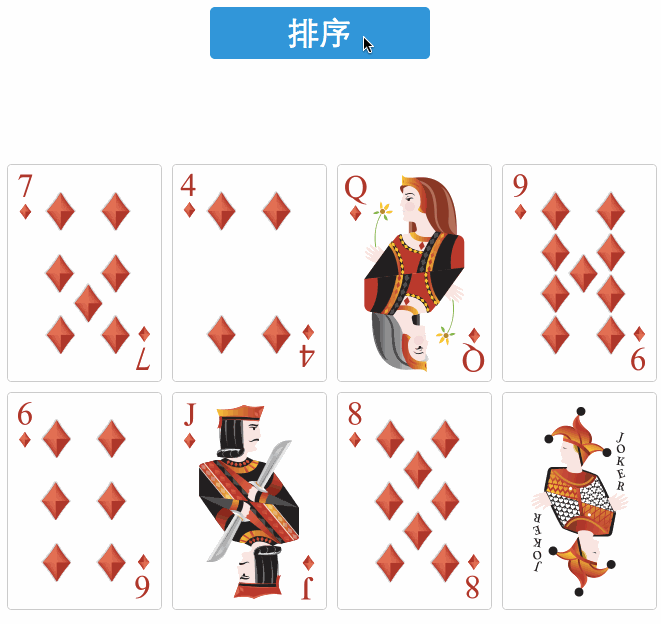

# 数组随机排序

经典的蜘蛛牌游戏中的洗牌：



下面介绍各种随机洗牌的实现。

## 1. 最简单的数组随机排序

```js
function randomSort(a, b) {
  return Math.random() > 0.5 ? -1 : 1;
}

var arr = [1, 2, 3, 4, 5, 6, 7, 8, 9];
arr.sort(randomSort);
```

由于 `sort()` 方法依次比较内部元素，因此这种排序方法并不是完全随机的。

## 2. 递归排序

```js
function randomSort(arr, newArr) {
  if (arr.length == 1) {
    newArr.push(arr[0]);
    return newArr;
  }

  var random = Math.ceil(Math.random() * arr.length) - 1;

  newArr.push(arr[random]);
  arr.splice(random, 1);

  return randomSort(arr, newArr);
}

for (var i = 0; i < 10; i++) {
  var arr = [1, 2, 3, 4, 5, 6, 7, 8, 9];
  var newArr = [];
  randomSort(arr, newArr);
  console.log(newArr);
}
```

## 3. 使用数组 sort 方法对数组元素随机排序

```js
Array.prototype.shuffle = function (n) {
  var len = this.length,
    num = n ? Math.min(n, len) : len,
    arr = this.slice(0);

  arr.sort(function (a, b) {
    return Math.random() - 0.5;
  });

  return arr.slice(0, num - 1);
};

var arr = [1, 2, 3, 4, 5, 6, 7, 8, 9];
arr.shuffle();
```

## 4. 随机交换数组内的元素

```js
var lib = {};
lib.range = function (min, max) {
  return min + Math.floor(Math.random() * (max - min + 1));
};
Array.prototype.shuffle = function (n) {
  var len = this.length,
    num = n ? Math.min(n, len) : len,
    arr = this.slice(0),
    temp,
    index;

  for (var i = 0; i < len; i++) {
    index = lib.range(i, len - 1);
    temp = arr[i];
    arr[i] = arr[index];
    arr[index] = temp;
  }

  return arr.slice(0, num);
};
```

## 5. 随机从原数组抽取一个元素，加入到新数组

```js
var lib = {};
lib.range = function (min, max) {
  return min + Math.floor(Math.random() * (max - min + 1));
};
Array.prototype.shuffle = function (n) {
  var len = this.length,
    num = n ? Math.min(n, len) : len,
    arr = this.slice(0),
    result = [],
    index;

  for (var i = 0; i < num; i++) {
    index = lib.range(0, len - 1 - i);
    // 或者 result.concat(arr.splice(index,1))
    result.push(arr.splice(index, 1)[0]);
  }

  return result;
};
```

## 6. underscore.js 中的 shuffle 方法 - 洗牌算法

```js
function random(min, max) {
  if (max == null) {
    max = min;
    min = 0;
  }

  return min + Math.floor(Math.random() * (max - min + 1));
}

function shuffle(arr) {
  var length = arr.length,
    shuffled = Array(length);

  for (var index = 0, rand; index < length; index++) {
    rand = random(0, index);

    if (rand !== index) {
      shuffled[index] = shuffled[rand];
    }

    shuffled[rand] = arr[index];
  }

  return shuffled;
}
```

## 7. 简化版洗牌算法

```js
function shuffle(arr) {
  var i, j, temp;

  for (i = arr.length - 1; i > 0; i--) {
    j = Math.floor(Math.random() * (i + 1));
    temp = arr[i];
    arr[i] = arr[j];
    arr[j] = temp;
  }

  return arr;
}
```
