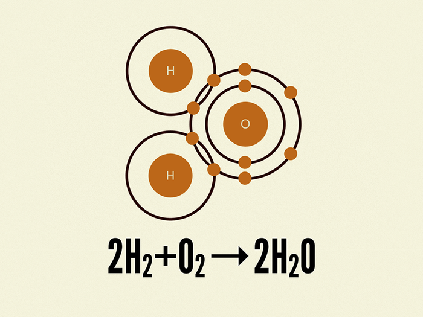
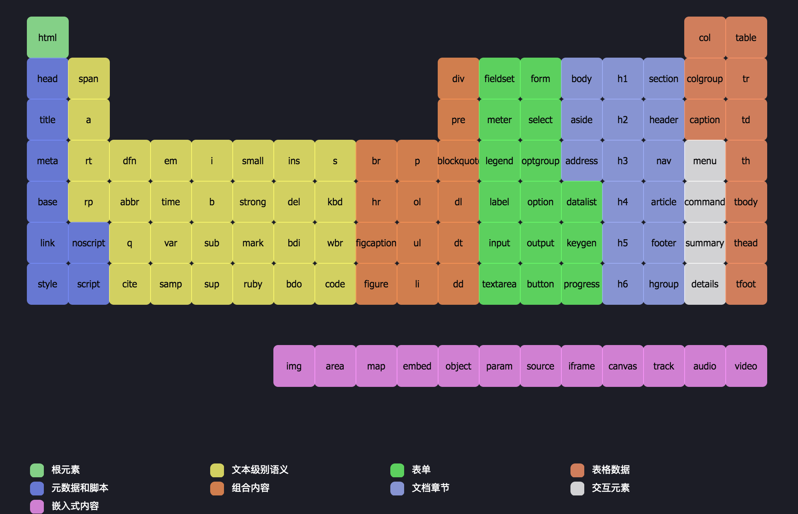
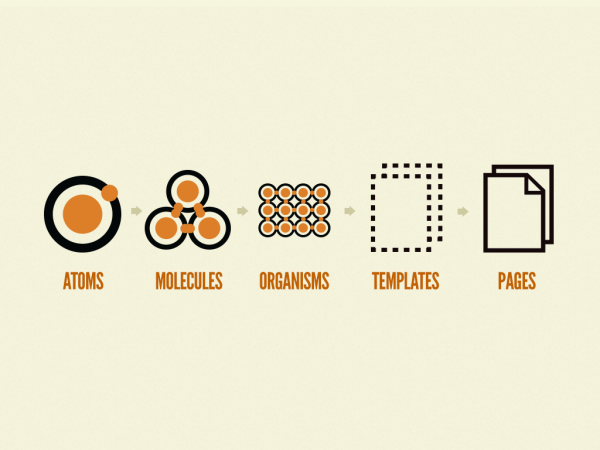
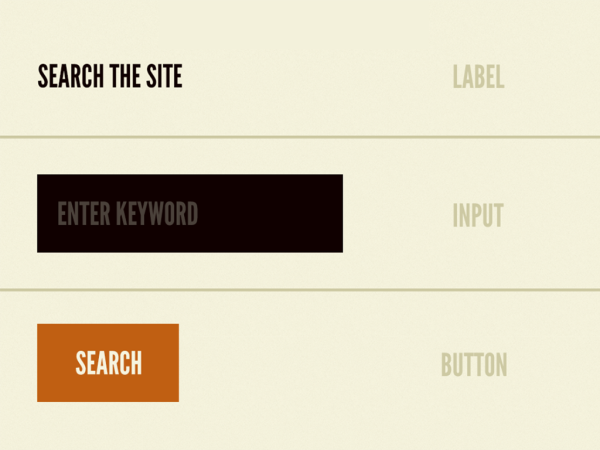
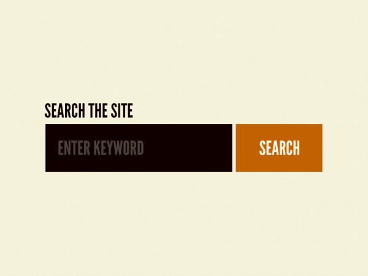
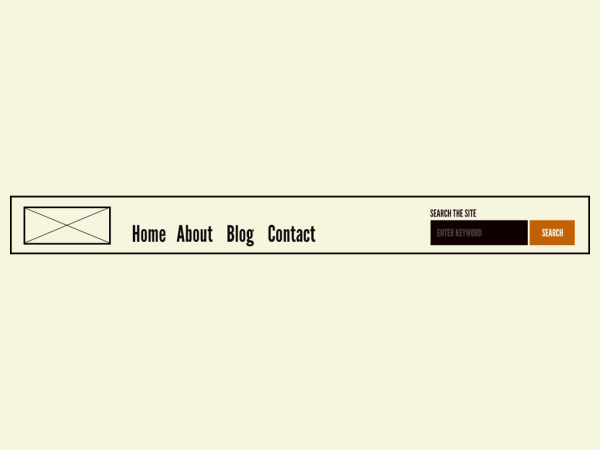
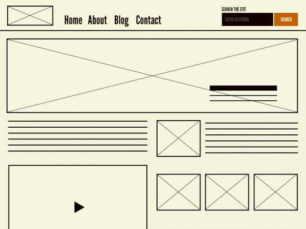
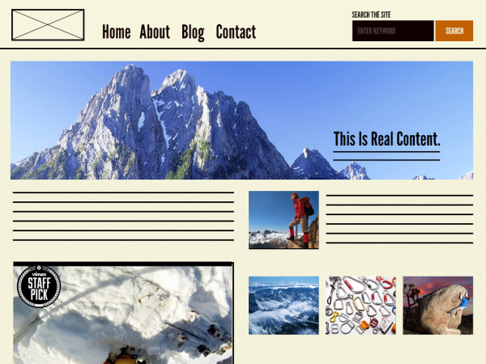

Atomic Design 原子设计 ┃ 构建科学规范的设计系统
===

## 背景

在 2013 年网页设计师 @Brad Frost 从化学中受到启发：原子（Atoms）结合在一起，形成分子（Molecures），进一步结合形成的生物体（Organisms）。

在已知宇宙中的所有事物都可以分解为一组有限的原子元素。@Brad 将这个概念应用在界面设计，我们的界面就是由一些基本的元素组成的。

通过在大层面（页）和小层面（原子）同时思考界面，Brad 认为可以利用原子设计建立一个适应组件的动态系统。

## 概念

原子设计是一种方法论，由原子、分子、组织、模板和页面共同协作以创造出更有效的用户界面系统的一种设计方法。

原子设计的五个阶段分别是：

**Atoms 原子**：为网页构成的基本元素。例如标签、输入，或是一个按钮，也可以为抽象的概念，例如字体、色调等。

**Molecules 分子**：由原子构成的简单 UI 组件。例如，一个表单标签，搜索框和按钮共同打造了一个搜索表单分子。

**Organisms 组织**：由原子及分子组成的相对复杂的UI构成物。

**Templates 模版**：将以上元素进行排版，显示设计的底层内容结构。

**Pages 页面**：将实际内容（图片、文章等）套件在特定模板，页面是模板的具体实例。

## 优点

### 1. Consistency 一致性

由于分解网站成单一元素，不论在哪一个页面，UI元素的互动性是相同的，例如颜色变化、字体的排序、以及回馈。不但让使用者经验相同，在视觉上更为和谐。

### 2. Efficiency 效率

由于建立了Pattern Library元件库，一旦要更改某一个元素，可以马上施行、应用。

### 3. Collaboration 跨部门的共通语言

不仅方便设计师思考页面的和谐性，也可以让工程师、品质检验清楚页面的逻辑架构及变化，减少不必要的来回沟通。

## 批评

### 1. WHAT我们变成了用组件设计的机器人？

很多人当听到原子设计“工业化”和“再利用”的特点时，都将它们理解“标准化”和“创造性限制”。

我不同意。当你真正找到了如何使用原子设计的方法时，你可以精确地决定何时何地给创造力腾出空间。

### 2. WHEN“我们什么时候需要创造力，什么时候需要一致性？

我们可以在使用设计系统和原子设计方法的同时富有创造性。明确一个评判标准：在哪里保持强烈的一致性，在哪里创造惊喜或者展示品牌的独特性。

如果我们想要一个强大的一致性和大量的重用系统，我们将从更具体和复杂的组件（如模板和页面）开始。

如果我们想给设计师更多创造性的可能性，我们会给他们原子和分子，这样他们就可以创造新的成分，同时保持系统相似性。

### 3. HOW我们该怎么办呢？

工业化可以帮助我们节省重复设计和无用工作的时间，而设计者却没有额外的价值，例如：在15个不同的屏幕上执行相同的修改，创建20个相同组件，或者替换10个相同的实例。

这种新获得的空闲时间应该允许我们为用户或客户设计更多有趣的元素：正确的用户流、品牌标识、用户反馈分析、开发创新的解决方案和进行相关的情感设计…

## 参考

[HTML 元素周期表](http://demo.yanue.net/HTML5element/)
