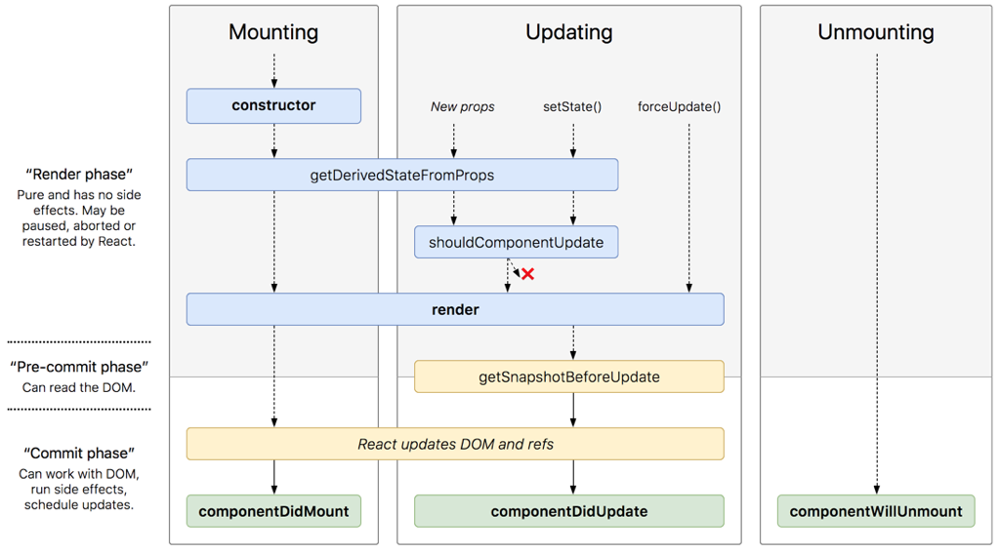

React 的生命周期
===

React组件的生命周期分为三个部分: `装载期间(Mounting)` ，`更新期间(Updating)` 和 `卸载期间(Unmounting)`，React16 多出来一个 `componentDidCatch()` 函数用于捕捉错误。



## 装载期间

组件被实例化并挂载在到DOM树这一过程称为装载，在装载期调用的生命周期函数依次为

* [constructor()](https://reactjs.org/docs/react-component.html#constructor)
* [getDerivedStateFromProps()](https://reactjs.org/docs/react-component.html#static-getderivedstatefromprops)
* [render()](https://reactjs.org/docs/react-component.html#render)
* [componentDidMount()](https://reactjs.org/docs/react-component.html#componentdidmount)

### constructor(props)

构造函数，和 Java class 的构造函数一样，用于初始化这个组件的一些状态和操作，如果你是通过继承 `React.Component` 子类来创建 React 的组件的，那么你应当首先调用 `super(props)` 初始化父类。

在 `contructor` 函数中，你可以 **初始化 state**，比如 `this.state = {xxx};`，不要在构造函数中使用 setState() 函数，强行使用的话 React 会报错。其次你可以在构造函数中 **进行函数 bind**，如:

```js
this.handleClick = this.handleClick.bind(this);
```

一个示例 contructor 实现如下:

```js
constructor(props) {
  super(props);

  this.state = {
    color: '#fff'
  };

  this.handleClick = this.handleClick.bind(this);
}
```

如果你不需要初始化状态也不需要绑定 handle 函数的 this，那么你可以不实现 constructor 函数，由默认实现代替。

### 关于 bind 函数的解释说明

注意 js 的 this 指向比较特殊，比如以下的例子作为 onClick 回调函数由 button 组件去调用的时候不会把组件类的上下文带过去。

```js
handleClick() {
  console.log('handleClick', this); // undefined
}
...
<button onClick={this.handleClick}>click</button>
```

这种问题推荐三种可能的解决方式，其核心均为将函数的 this 强制绑定到组件类上:

1. 就是上面说的在 `constructor` 函数中显示调用 `bind`。
2. 在 `onClick` 的时候进行 `bind:`，这种方式的劣势是每次调用的时候都需要进行 bind，优势是方便传参，处理函数需要传参可以参考React的文档 [Passing Arguments to Event Handlers](https://reactjs.org/docs/handling-events.html#passing-arguments-to-event-handlers)。
3. 声明函数时使用箭头匿名函数，箭头函数会自动设置 this 为当前类。(简洁有效，墙裂推荐)。

```js
handleClick = () => {
  console.log('handleClick', this); // Component
}
```

### getDerivedStateFromProps()

这个函数会在 `render` 函数被调用之前调用，包括第一次的初始化组件以及后续的更新过程中，每次接收新的 props 之后都会返回一个对象作为新的 state，返回 null 则说明不需要更新 state。

该方法主要用来替代 `componentWillReceiveProps` 方法，willReceiveProps 经常被误用，导致了一些问题，因此在新版本中被标记为 unsafe。以 [掘金上的例子](https://juejin.im/post/5abf4a09f265da237719899d) 为例，`componentWillReceiveProps` 的常见用法如下，根据传进来的属性值判断是否要 load 新的数据：

```js
class ExampleComponent extends React.Component {
  state = {
    isScrollingDown: false,
  };

  componentWillReceiveProps(nextProps) {
    if (this.props.currentRow !== nextProps.currentRow) {
      // 检测到变化后更新状态、并请求数据
      this.setState({
        isScrollingDown: nextProps.currentRow > this.props.currentRow,
      });

      this.loadAsyncData()
    }
  }

  loadAsyncData() {/* ... */}
}
```

但这个方法的一个问题是外部组件多次频繁更新传入多次不同的 props，而该组件将这些更新 batch 后仅仅触发单次自己的更新，这种写法会导致不必要的异步请求，相比下来 `getDerivedStateFromProps` 配合`componentDidUpdate` 的写法如下:

```js
class ExampleComponent extends React.Component {
  state = {
    isScrollingDown: false,
    lastRow: null,
  };

  static getDerivedStateFromProps(nextProps, prevState) {
    // 不再提供 prevProps 的获取方式
    if (nextProps.currentRow !== prevState.lastRow) {
      return {
        isScrollingDown: nextProps.currentRow > prevState.lastRow,
        lastRow: nextProps.currentRow,
      };
    }

    // 默认不改动 state
    return null;
  }

  componentDidUpdate() {
    // 仅在更新触发后请求数据
    this.loadAsyncData()
  }

  loadAsyncData() {/* ... */}
}
```

这种方式只在更新触发后请求数据，相比下来更节省资源。

注意 `getDerivedStateFromProps` 是一个 static 方法，意味着拿不到实例的 this。

### render()

该方法在一个 React 组件中是必须实现的，你可以看成是一个 Java interface 的接口。

这是 React 组件的核心方法，用于根据状态 state 和属性 props 渲染一个 React 组件。我们应该保持该方法的纯洁性，这会让我们的组件更易于理解，只要 state 和 props 不变，每次调用render返回的结果应当相同，所以请不要在 render 方法中改变组件状态，也不要在在这个方法中和浏览器直接交互。

### componentDidMount()

`componentDidMount` 方法会在 `render` 方法之后立即被调用，该方法在整个React生命周期中只会被调用一次。React的组件树是一个树形结构，此时你可以认为这个组件以及他下面的所有子组件都已经渲染完了，所以在这个方法中你可以调用和真实 DOM 相关的操作了。

有些组件的启动工作是依赖 DOM 的，例如动画的启动，而 `componentWillMount` 的时候组件还没挂载完成，所以没法进行这些启动工作，这时候就可以把这些操作放在 `componentDidMount` 当中。

我们推荐可以在这个函数中发送异步请求，在回调函数中调用 `setState()` 设置 state，等数据到达后触发重新渲染。但注意尽量不要在这个函数中直接调用 `setState()` 设置状态，这会触发一次额外的重新渲染，可能造成性能问题。

下面的代码演示了如何在 `componentDidMount` 加载数据并设置状态:

```js
componentDidMount() {
  console.log('componentDidMount');
  fetch("https://api.github.com/search/repositories?q=language:java&sort=stars")
    .then(res => res.json())
    .then((result) => {
      this.setState({ // 触发render
        items: result.items
      });
    })
    .catch((error) => {
      console.log(error)
    });

  // this.setState({color: xxx}) // 不要这样做
}
```

## 更新期间

当组件的状态或属性变化时会触发更新，更新过程中会依次调用以下方法:

* getDerivedStateFromProps() 上文已描述，不赘述
* [componentWillUpdate()](https://reactjs.org/docs/react-component.html#unsafe_componentwillupdate)
* [render()](https://reactjs.org/docs/react-component.html#render)
* [getSnapshotBeforeUpdate()](https://reactjs.org/docs/react-component.html#getsnapshotbeforeupdate)
* [componentDidUpdate()](https://reactjs.org/docs/react-component.html#componentdidupdate)

### shouldComponentUpdate(nextProps, nextState)

你可以用这个方法来告诉 React 是否要进行下一次 `render()`，默认这个函数返回 true，即每次更新状态和属性的时候都进行组件更新。注意这个函数如果返回 false 并不会导致子组件也不更新。

这个钩子函数一般不需要实现, 如果你的组件性能比较差或者渲染比较耗时，你可以考虑使[React.PureComponent](https://reactjs.org/docs/react-api.html#reactpurecomponent) 重新实现该组件，PureComponent 默认实现了一个版本的 shouldComponentUpdate 会进行 state 和 props 的比较。当然如果你有自信，可以自己实现比较nextProps 和 nextState 是否发生了改变。

该函数通常是优化性能的紧急出口，是个大招，不要轻易用，如果要用可以参考 [Immutable 详解及 React 中实践](https://github.com/camsong/blog/issues/3)。

### getSnapshotBeforeUpdate()

该方法的触发时间为 update 发生的时候，在 render 之后 DOM 渲染之前返回一个值，作为componentDidUpdate 的第三个参数。该函数与 componentDidUpdate 一起使用可以取代 componentWillUpdate 的所有功能，比如以下是官方的例子:

```js
class ScrollingList extends React.Component {
  constructor(props) {
    super(props);

    this.listRef = React.createRef();
  }

  getSnapshotBeforeUpdate(prevProps, prevState) {
    // Are we adding new items to the list?
    // Capture the scroll position so we can adjust scroll later.
    if (prevProps.list.length < this.props.list.length) {
      const list = this.listRef.current;
      return list.scrollHeight - list.scrollTop;
    }

    return null;
  }

  componentDidUpdate(prevProps, prevState, snapshot) {
    // If we have a snapshot value, we've just added new items.
    // Adjust scroll so these new items don't push the old ones out of view.
    // (snapshot here is the value returned from getSnapshotBeforeUpdate)
    if (snapshot !== null) {
      const list = this.listRef.current;

      list.scrollTop = list.scrollHeight - snapshot;
    }
  }

  render() {
    return (
      <div ref={this.listRef}>
        {/* ...contents... */}
      </div>
    );
  }
}
```

### componentDidUpdate(prevProps, prevState, snapshot)

该方法会在更新完成后被立即调用，你可以在这个方法中进行 DOM 操作，或者做一些异步调用。这个和首次装载过程后调用 componentDidMount 是类似的，不一样的是你可能需要判断下属性是否变化了再发起网络请求，如：

```js
componentDidUpdate(prevProps) { // 来自网络
  if(prevProps.myProps !== this.props.myProp) {
    // this.props.myProp has a different value
    // we can perform any operations that would
    // need the new value and/or cause side-effects
    // like AJAX calls with the new value - this.props.myProp
  }
}
```

## 卸载期间

该方法会在组件被卸载之前被调用，如果你学过 C++，那么这玩意和析构函数差不多，在方法里清理内存之类的，当然如果你用 Java 请不用在意。如上所述，你可以在这个函数中进行相关清理工作，比如删除定时器之类的。

下面给个示例代码:

```js
componentWillUnmount() {
  console.log('componentWillUnmount');

  // 清除timer
  clearInterval(this.timerID1);
  clearTimeout(this.timerID2);

  // 关闭socket
  this.myWebsocket.close();

  // 取消消息订阅...
}
```

## 错误捕获

React16中新增了一个生命周期函数:

* [componentDidCatch()](https://reactjs.org/docs/react-component.html#componentdidcatch)

### componentDidCatch(error, info)

在 React 组件中如果产生的错误没有被被捕获会被抛给上层组件，如果上层也不处理的话就会抛到顶层导致浏览器白屏错误，在React16中我们可以实现这个方法来捕获子组件产生的错误，然后在父组件中妥善处理，比如搞个弹层通知用户网页崩溃等。

在这个函数中请只进行错误恢复相关的处理，不要做其他流程控制方面的操作。比如:

```js
componentDidCatch(error, info) { // from react.org
    // Display fallback UI
    this.setState({ hasError: true });

    // You can also log the error to an error reporting service
    logErrorToMyService(error, info);
  }
```
