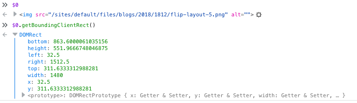
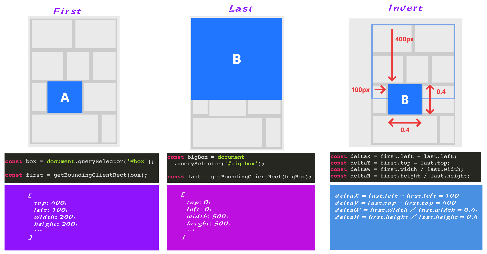

FLIP 技术给 Web 布局带来的变化
===

> 在创建UI时，添加合理的UI过渡动效，避免跳转和瞬间移动。如果将生活中的一些自然运动用到UI动效中来，将会给你的用户带来眼前一亮的感觉。毕竟，所有与你互动的东西都源自于生活中自然的运动。著作权归作者所有。

FLIP 技术可以以一种高性能的方式来动态的改变 DOM 元素的位置和尺寸，而不需要管它的布局是如何计算或渲染的（比如，`height`、`width`、`float`、绝对定位、Flexbox 和 Grid 等）。在改变的过程中将赋予一定的动效，从而达到我们所需要的目的，让 UI 动效更为合理，相应增强用户的体验。

## FLIP 是什么

FLIP 是一种记忆设备和技术，最早是由 @Paul Lewis 提出的，FLIP 是 **First**、**Last**、**Invert** 和 **Play** 四个单词首字母的缩写。

**First**，指的是在任何事情发生之前（过渡之前），记录当前元素的位置和尺寸。可以使用 `getBoundingClientRect()` 这个 API 来处理，比如：

```js
// 获取当前元素的边界
const first = el.getBoundingClientRect();
```

`getBoundingClientRect()` 将会返回一个 DOMRect 对象，如下图所示：



**Last**：执行一段代码，让元素发生相应的变化，并记录元素在最后状态的位置和尺寸，比如：

```js
// 通过给元素添加一个类名，设置元素最后状态的位置和大小 （在.totes-at-the-end中添加相应的样式规则） 
// 布局发生了变化 
el.classList.add('totes-at-the-end');

// 记录元素最后状态的位置和尺寸大小 
const last = el.getBoundingClientRect();
```

**Invert**：计算元素第一个位置（`first`）和最后一个位置（`last`）之间的位置变化（如果需要，还可以计算两个状态之间的尺寸大小的变化），然后使用这些数字做一定的计算，让元素进行移动（通过 `transform` 来改变元素的位置和尺寸），从而创建它位于第一个位置（初始位置）的一个错觉：

```js
const deltaX = first.left - last.left;
const deltaY = first.top - last.top;
const deltaW = first.width / last.width;
const deltaH = first.height / last.height;
```

**Play**：将元素反转（假装在 `first` 位置），我们可以把 `transform` 设置为 `none`，将其移动到 `last` 位置，让元素有动画效果：

```js
elm.animate(
    [
        {
            transformOrigin: 'top left',
            transform: `
                translate(${deltaX}px, ${deltaY}px)
                scale(${deltaW}, ${deltaH})
            `
        },
        {
            transformOrigin: 'top left',
            transform: 'none'
        }
    ], 
    {
        duration: 300,
        easing: 'ease-in-out',
        fill: 'both'
    }
);
```

> 在 **Play** 中使用了 Web Animations API。

把所有代码合在一起，如下：

```js
// 获取当前元素的边界
const first = el.getBoundingClientRect()

// 通过给元素添加一个类名，设置元素最后状态的位置和大小 （在.totes-at-the-end中添加相应的样式规则）
// 布局发生了变化
el.classList.add('totes-at-the-end')

// 记录元素最后状态的位置和尺寸大小
const last = el.getBoundingClientRect()

const deltaX = first.left - last.left
const deltaY = first.top - last.top
const deltaW = first.width / last.width
const deltaH = first.height / last.height

elm.animate(
    [{
        transformOrigin: 'top left',
        transform: `
            translate(${deltaX}px, ${deltaY}px)
            scale(${deltaW}, ${deltaH})
        `
    },
    {
        transformOrigin: 'top left',
        transform: 'none'
    }], {
        duration: 300,
        easing: 'ease-in-out',
        fill: 'both'
    }
);
```

FLIP 技术制作的动效原理：


