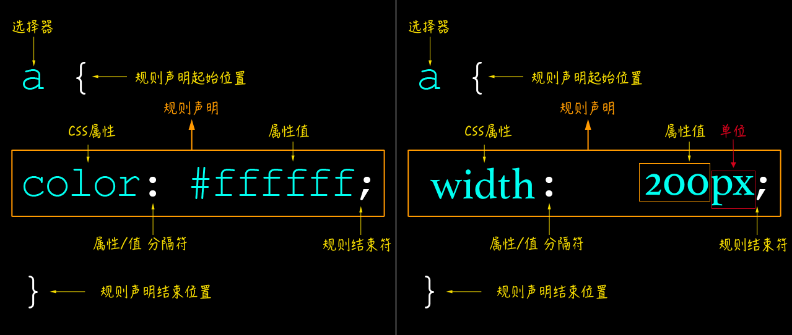

图说 CSS：CSS 的值和单位
===

## CSS 的值

常见 CSS 样式规则：



我们在声明任何一个 CSS 的规则都可能会包括：

* CSS 的选择器
* CSS 的属性
* CSS 的属性值
* CSS 的属性值单位

在写 CSS 的时候可能会涉及到的 CSS 的值会有：

* 数值：长度值 `<length>`，用于指定例如元素 `width`、`border-width`、`font-size` 等属性的值，这些值可能带有单位，也可能不带任何单位
* 百分比：可以用于指定尺寸或长度，例如取决于父容器的 `width`、`height` 或默认的 `font-size`
* 颜色：用于指定 `background-color`、`color` 等
* 坐标位置：以屏幕的左上角为坐标原点定位元素的位置，比如常见的 `background-position`、`top`、`right`、`bottom` 和 `left` 等属性
* 函数：用于指定背景图片或背景图片的渐变，比如 `linear-gradient()`、`image-set()` 等

简单的概括一下：**CSS 属性的值有多种，可以是数值、字符串、关键词或函数；同时 CSS 的属性的值可以带单位也可以不带单位**。

## CSS 的单位

CSS 的单位直接对 CSS 的值的计算是有直接影响的，在 CSS 中单位的之间有一个关系图，如下所示：


W3C 规范的 CSS 单位：


### 绝对单位

在 CSS 中有些单位是绝对值，不受任何屏幕大小或字体的影响。这些单位的显示可能会根据不同的屏幕分辨率而有所不同，因为它们取决于屏幕的 DPI（每英寸上的点数）。绝对单位常用于一些物理测量上。在环境输出已知的情形下非常有用。在 CSS 中，绝对单位包括：`px`、`in`、`cm`、`mm`、`pc` 和 `pt` 等。其中 `px` 是我们最为常见的一个绝对单位。到目前为止，`px` 在 CSS 的使用中也可以算是主流单位之一。

像素单位被认为是许多其他单位的测量基础。它提供了各种设备中一致的结果。也被认为是最好的**设备像素**，而这种像素长度和你在显示器上看到的文字屏幕像素元关。因为 `px` 实际上是一个按角度度量的单位，即**像素角度**。

很多时候，`px` 也常被称为 CSS 像素。它是一个绝对单位，但也可以被视为相对单位，为什么这么说呢？那是因为像素单位相对的是设备像素。在同一样的设备上，每 `1` 个 CSS 像素所代表的物理像素是可以变化的（即 CSS 像素的第一方面的相对性）；在不同的设备之间，每 `1` 个 CSS 像素所代表的物理像素是可以变化的（即 CSS 像素的第二方面的相对性）。

根据维基百科的解释：

> 它是图像显示的基本单元，既不是一个确定的物理量，也不是一个点或者小方块，而是一个抽象概念。所以在谈论像素时一定要清楚它的上下文！

由于不同的物理设备的物理像素的大小是不一样的，所以 CSS 认为浏览器应该对 CSS 中的像素进行调节，使得浏览器中 `1` 个 CSS 像素的大小在不同物理设备上看上去大小总是差不多 ，目的是为了保证阅读体验一致。为了达到这一点浏览器可以直接按照设备的物理像素大小进行换算，而 CSS 规范中使用"参考像素"来进行换算。

`1` 个参考像素即为从一臂之遥看解析度为 `96DPI` 的设备输出（即 `1` 英寸 `96` 点）时，`1` 点（即 `1/96` 英寸）的视角。它并不是 `1/96` 英寸长度，而是从一臂之遥的距离处看解析度为 `96DPI` 的设备输出一单位（即 `1/96` 英寸）时视线与水平线的夹角。通常认为常人臂长为 `28` 英寸，所以它的视角是:

```bash
(1/96)in / (28in * 2 * PI / 360deg) = 0.0213度。
```

由于 CSS 像素是一个视角单位，所以在真正实现时，为了方便基本都是根据设备像素换算的。浏览器根据硬件设备能够直接获取 CSS 像素。


> 简单介绍一下一臂之遥：我们在使用不同设备输出时，眼睛与设备输出的典型距离是不同的。比如电脑显示器，通常是一臂之距，而看书和纸张时（对应于打印机的设备输出），则通常会更近一些。看电视时则会更远，比如一般建议是电视机屏幕对角线的 `2.5` 到 `3` 倍长 —— 如果你是个 `42` 英寸彩电，那就差不多是 `3` 米远。

这样描述对于很多 CSSer 太过于理论，我们还是回到实际中了。比如说我在项目中有一个盒子元素，它的大小是宽高都是 `150px`，那么我们在 CSS 中常常这么使用：

```css
.box {
    width: 150px;
    height: 150px;
}
```

虽然说，像素应该是设备和显示器中显示趋于一致，但是他越来越不正确。那是因为，随站 Retina 屏的出现，`dpr` 不同（设备像素比），对像素和显示器显示会略有不同。比如下图所示：


正因如此，在移动端设计当中，大部分设计都采用 `2` 倍或 `3` 倍尺寸进行设计。

虽然说 `px` 是 CSS 最绝对单位中最常见，使用最频繁的一个单位。而事实上，CSS 中绝对单位不仅仅这一个，还有其他的绝对单位，比如 `in`（英寸）、`cm`（厘米）、`mm`（毫米）、`pc` 和 `pt` 等。其中，`in`、`cm` 和 `mm` 可以和 `px` 直接进行换算：

```bash
`1in = 96px`
`1cm = 37.8px`
`1mm = 3.78px`
```

而 `pc` 和 `pt` 和 `in` 有直接关系：

```bash
`1in = 72pt`
`1in = 6pc`
```

如果你希望 `pt` 和 `pc` 直接和 `px` 进行换算的话，可以借助 `in` 为中间桥梁。比如：

```bash
`1in = 96px = 72pt`，那么 `1px = 72 / 96 = 0.75pt`
`1in = 96px = 6pc`，那么 `1px = 6 / 96 = 0.0625pc`
```

可以用一张简单的图来描述绝对单位之间的关系：


在规范中，绝对单位还有一个新单位，不怎么常见，即 `Q`，`1Q` 相当于 `25mm`。它被用于印刷排版。

### 相对单位

相对单位和绝对单位有所不同，相对单位是相对于另一个长度的长度。使用相对单元的样式更容易离开一个输出环境并适应另一个环境。CSS 的相对单位主要分为两大类，其一是字体相对单位，会根据 `font-size` 进行计算；其二是视窗相对单位，相对于视窗大小来决定。

### 字体相对单位

字体相对单位主要有 `em`、`rem`、`ex`、`ch`、`cap`、`ic`、`lh` 和 `rlh`。其中 `em`、`rem`、`ex` 和 `ch` 是较为常见的字体相对单位。在这里我们也只会介绍这几个常见的单位。

#### em

在 CSS 中，如果没有任何 CSS 规则影响的前提之下，1em的长度是：

```bash
1em = 16px = 0.17in = 12pt = 1pc = 4.mm = 0.42cm
```

众所周知，每个浏览器都有一个默认的 `font-size` 大小，而这个值通常是 `16px`（用户未修改浏览器字号时）。这也就是为什么 `1em = 16px` 的原理所在。


`em` 还有一点很重要：`em` 和它们的祖先元素的 `font-size` 有关系。因此，如果祖先元素的 `font-size` 设置为 `0.5em`，同时它的子元素的 `font-size` 设置为1em，在这一情景之下计算出来的 `font-size` 将为会是 `16 x 0.5 = 8px`：


在 `px` 和 `em` 之间的转换存有一定的公式在，如下：

```bash
1 ÷ 父元素的font-size × 需要转换的像素值 = em值
```

我们也可以借助于 JavaScript，写一个简单的转换函数：

```js
function px2em(pixel,parentFontSize) {
    retrun (pixel / parentSize) + 'em'
}

px2em(10, 16) // => 0.625em
```

`em` 单位除了应用于 `font-size` 属性之外，还可以运用于可以使用 `<length>` 值的其他属性，比如 `width`、`margin`、`padding`、`border-width` 和 `text-shadow` 等等。

> `<length>` 是表示距离尺寸的一种 CSS 数据格式。它由一个 `<number>` 后紧随一个长度单位，比如 `px`、`em`、`pt`、`in` 等等。和任何 CSS 尺寸一样，数字和单位之间没有空格。如果 `<number>` 为 `0` 的话，其之后的长度单位是可选的。

如果在非 `font-size` 的属性上使用 `em` 做为 `<length>` 值的单位时，将会受元素`font-size` 的影响。在众多开发者中有一个比较普遍的语解，认为 `em` 单位是相对于父元素的 `font-size`。而事实上呢？它们是**相对于使用 `em` 单位元素的 `font-size`**。父元素的 `font-size` 可以影响 `em` 值，但这种情况的发生，纯粹是因为继承。

#### rem

`rem` 相对于 `em` 而言没有那么复杂，他仅仅是相对于根元素 `<html>` 的 `font-size` 计算。W3C 规范是这样描述 `rem` 的：

> Font size of the root element！

很多时候，我们可以把 `rem` 作为 `em` 的替代品。特别是在 `font-size` 属性上的运用，但 `rem` 和 `em` 有一个最大的区别：**任何值为 `1rem` 的元素都等于 `16px`，当然，其前提是浏览器默认的 `font-size` 没有被用户重置，或者未显式的给 `html` 元素设置`font-size` 值；另外，`rem` 可以不管它的父元素的 `font-size` 如何！**

另外，`rem` 和 `em` 有点类似，能接受 `<length>` 为值的属性都可以以 `rem` 为单位，而且都是相对于根元素 `html` 的 `font-size` 进行计算，并且跟 DOM 的层级没有任何的关系。

#### em 还是 rem

> `em` 好，还是 `rem` 好，应该选择哪个更好？

事实上，这是一个极具争议的一个问题。

> 没有最好的，只有最适合的!

对于是选择 `rem` 还是 `em`，应该出于理智，在不同的地方使用 `rem` 或 `em`。事实上，很多成功的案例也证明了这样的观点：

* 如果这个属性根据它的 `font-size` 来进行测量，则应该选择 `em`
* 其他的一切事物均应该使用 `rem`

同时，大家也可以根据两者的差异性来进行选择：

* `rem` 和 `em` 在客户端中计算出来的样式值（计算样式（Computed Style））都会以 `px` 显式
* `rem` 相对于根元素 `html` 的 `font-size` 计算，`em` 相对于元素 `font-size` 计算
* `rem` 可以从浏览器字体设置中继承 `font-size` 值，`em` 可能受任何继承过来的父元素`font-size` 的影响
* 使用 `em` 应该根据组件的 `font-size` 来定，而不是根元素的 `font-size` 来定
* 在不需要使用 `em` 单位，并且需要根据浏览器的 `font-size` 设置缩放时，应该使用 `rem`

#### ex和ch

`ex` 和 `ch` 是排版单位，这意味着它们的值取决于元素的 `font-family`。而我们在使用 `em` 和 `rem` 单位时，浏览器会根据元素的 `font-size` 计算它们的值。无论屏幕上显示的是什么字体，浏览器计算出来的值都是相同的。这就是 `ex` 和 `ch` 单位提供更多灵活性的地方。它们要求浏览器在计算值和应用样式之前要确定好引用的 `font-family`。因为，元素的`font-family` 样式对 `ex` 和 `ch` 单位值的计算有直接关系和影响。

#### 视窗相对单位

CSS 中除了字体相对单位之外还有视窗相对单位，主要有 `vw`、`vh`、`vmin` 和 `vmax`。

在 PC 端，视窗指的是浏览器的可视区域，而在移动端中相对来说更为复杂一些，它包括三个视窗：**布局视窗**（Layout Viewport）、**视觉视窗**（Visual Viewport）和**理想视窗**（Ideal Viewport）：


而我们要说的视窗单位中的视窗指的是：**PC 端指的是浏览器可视区域，移动端的是布局视窗（Layout Viewport）**：


在 CSS 中视窗单位主要有：

* `vw`：视窗宽度的百分比
* `vh`：视窗高度的百分比
* `vmin`：当前较小的 `vw` 和 `vh`
* `vmax`：当前较大的 `vw` 和 `vh`

图片描述如下：


例如，如果浏览器的高是 `900px`，`1vh` 求得的值为 `9px`。同理，如果显示窗口宽度为`750px`，`1vw` 求得的值为 `7.5px`。

`vh` 和 `vw` 总是与视窗的高度和宽度有关，与之不同的，`vmin` 和 `vmax` 是与视窗宽度和高度的最大值或最小值有关，取决于哪个更大和更小。

例如，如果浏览器设置为 `1100px` 宽、`700px` 高，`1vmin` 会是 `7px`，`1vmax` 为`11px`。然而，如果宽度设置为 `800px`，高度设置为 `1080px`，`1vmin` 将会等于 `8px` 而 `1vmax` 将会是 `10.8px`。

### 角度单位

说到角度单位，事实上大家说到的更是度数单位。

### CSS 中的旋转

角度最常用的用法之一就是在 CSS 中给旋转元素设置一个旋转角度（度数），依赖于 CSS 的 `transform` 属性中的 `rotate()`，`skew()` 函数等。其中给 `rotate()` 函数传一个角度的值，让元素做相应的旋转。比如：

```css
.rectangle {
    width: 200px;
    height: 100px;
    border: 10px solid #83B692;
    background-color: #BEE7B8;
    margin: 100px;
    transform: rotate(37deg);
}
```

给 `rotate()` 函数设置了一个 `37deg` 的值，告诉元素 `.rectangle` 围绕着旋转原点（旋转原点可以通过 `transform-origin` 属性进行设置）旋转 `37deg`。最终这个 `.rectangle` 元素旋转后的效果如下图所示：


看到这样的旋转结果，你是不是感到有点奇怪？`37` 度旋转出来的效果应该像下面这样才对，是吧？


我们在浏览器中看到的效果几乎与此相反。原因是与 Web 上定义旋转的方向有关系。在现实中，**角度值是随着逆时针方向增加**。在 Web 上，**角度值却是随着顺时针方向增加**。


这似乎看上去有点奇怪，但事实就是这样，我们也无法改变。我们所要做的就是**记住这样的差异性，并在实际使用的时候做相应的调整**。

#### CSS 渐变中的角度

在 CSS 中还会使用到角度的另外一个典型属性是 CSS 渐变的相关属性。比如线性渐变属性 `linear-gradient()`：

```css
background: linear-gradient(45deg, #f36, #389);
```

上面代码中的 `45deg` 指的是渐变的角度。

在 CSS 的渐变属性中可以通过下面两种方法来定义这个角度：

* 使用关键词：`to top`、`to bottom`、`to left`、`to right`、`to top right`、`to top left`、`to bottom right` 和 `to bottom left`
* 使用带单位数字定义角度，比如 `45deg`、`1turn` 等

如果省略角度值的设置，那默认是 `to bottom`（对应 `180deg` 或者 `.5turn`）：


在上面的示例中，渐变角度是没有设置，`white` 至 `red` 渐变色从 `top` 至 `bottom` 渐变，它和使用 `to bottom` 关键词得到的效果是一样的，如下所示：


除了使用这些关键词之外，还可以使用明确的角度值，比如 `45deg`，而且更建议你使用角度值来替代关键词。下图能帮助我们看看渐变角度动态变化时，渐变线是怎么移动的：


#### Canvas 中的角度

大家都知道，`canvas` 可以用来帮助我们绘制一些几何图形，也可以帮助我们做很多 CSS 之类无法做到的事情。在 `canvas` 的部分 API 中也会使用到角度，比如使用 `arc()`、`arcTo()` 绘制圆和圆弧以及 Canvas 中的 `rotate()` 方法。

在 Canvas 中，角度的测量和我们常见的角度测量是有所差异的，其差异如下图所示：


然而，在 Canvas 中，角度并不是我们通常意义上所了解的角度，而是用弧度来表示的。比如，一个圆是 `360` 度，那么用弧度来表示的，其对应的就是 `2π` 弧度，即以圆心为坐标原点，开始计算开始弧度与终止弧度。顺时针还是逆时针就是画线的方向（或者旋转方向），比如像下图这样：


对于很多 Web 开发者而言，大家更为熟知的是度数来表达角度，所以说，要在 canvas 中使用度数，那还需要做一步转化过程，把度数转换成弧度。不过有关于度数转弧度，我们在后面会简单的介绍。

#### HSL 中的角度

在 CSS 中，我们有多种指定颜色的方式，最为经典的是十六进制和 `RGB` 格式。除此之外，我们还可以使用另一种指定颜色的格式，即 `HSL`。其中 `HSL` 分别是色相（`Hue`），饱和度（`Saturation`）和亮度（`Lightness`）三个单词的首字母。

在 Web 中可以通过 `hsl` 或 `hsla` 函数来指定 `HSL` 格式中的任何颜色，这两个数都类似，唯一的区别是 `hsla` 增加了对透明度的支持。比如，我们可以像下面这样使用 `hsla` 来指定颜色：

```css
background-color: hsla(54, 100%, 62%, 1);
```

上面使用 `hsla` 指定了 `background-color` 的值，上面的代码 `hsla(54, 100%, 62%, 1)` 是一个黄橙色。


`HSL` 颜色（以及 `hsla` 函数的扩展）是由四个值组成：**色相**，**饱和度**，**亮度** 和 **透明度**。

`HSL` 中的 `H`，也就是颜色的色相，它指定色相的方式是**以度数为单位的，这些度数映射到色盘上的颜色**，比如像下图这样：


在我们这个示例中，指定的颜色的色相值是 `54` 度。对应到色盘上的位置，就是我们看到的黄橙色。在实际使用的时候，如果一时无法确定角度值对应色盘上的颜色，我们可以借助浏览器开发者工具来帮助我们，比如像下面这样：


#### 其他度数单位

前面我们大部分聊的都是角度单位，其实除了角度单位，我们还有百分度（`grad`）、弧度（`rad`）和圈数（`turn`）单位：

* 百分度（`grads`）：一个分度，或者说是百分度相对于 `1/400` 个整圆，跟角度单位一样，支持负值，负值表示逆时针方向，其中 `100grad` 相当于 `90deg`
* 弧度（`rad`）：在 Canvas 部分简单提到过弧度，`1rad` 等于 `180/π` 度（大约为`57.3deg`）,另外 `1.570796326794897rad` 相当于 `100grad` 或是 `90deg`
* 圈数（`turn`）：`1` 圈等于 `360deg`

#### 弧度和度数间转换

在前面，我们在 CSS 中大部分情况使用的是角度值都是用度数(`deg`)来做为单位值，事实上也可以像在 JavaScript 中使用弧度 `rad` 做为单位值。

正如大家所了解的一样。一个完整的圆的弧度是 `2π`，所以 `2π rad = 360°`，`1 π rad = 180°`，`1°= π/180 rad`，`1 rad = 180°/π`（约 `57.29577951°`）。以度数表示的角度，把数字乘以 `π/180` 便转换成弧度；以弧度表示的角度，乘以 `180/π` 便转换成度数。

```ini
rad = (π / 180) * deg
```

同样的：

```ini
deg = (rad * 180) / π
```

平时我们常看到的各种弧度如下：


上面简单的介绍了度数和弧度之间的关系。其实在 JavaScript 中我们可以很容易实现度数和弧度之间的换数：

```ini
rad = (Math.PI * deg) / 180
```

同样的：

```ini
deg = (rad * 180) / Math.PI
```

为了方便计算和使用，可以将其封装成 JavaScript 函数：

```js
function getRads (degrees) {
    return (Math.PI * degrees) / 180;
}

function getDegrees (rads) {
    return (rads * 180) / Math.PI;
}
```

比如我们要将 `30deg` 转换成 `rad`，可以直接使用：

```js
getRads(30); // 0.5235987755982988rad
getDegrees(0.7853981633974483); // 45deg
```

下图展示了常见的角度和弧度之间的换算：


### 百分比单位

CSS 中百分比 `%` 单位也是一个很重要也是很常用的单位，和 `px`、`em` 类似，在 CSS 中接受 `<length>` 值的属性都可以使用 `%` 单位。但在不同的使用场合，其意义将会有很多地不同。正因如此，要理解 `%` 这个单位，其关键点是：**百分比是一定要有其对应的参照值**，也就是说，**百分比值是一种相对值，任何时候要分析它的计算值，都需要正确的找到它的参照值**。

言外之意，CSS 中的百分比单值最终计算出来的值是可变的。常见的可以分为以下几个大类：

#### 定位中的百分比

在 CSS 中用来控制 `position` 位置的 `top`、`right`、`bottom` 和 `left` 都可以使用百分比作为单位。如果它们的值为百分比时，其对应的参照物是包含块（但不一定是其父容器）同方向的 `width` 或 `height` 计算。

刚才提到过，定位属性中的参照物：**包含块并不一定是其父容器**。为什么这么说呢？因为在 CSS 中position对应的属性值不一样，其对应的包含块也将不同：

* 如果元素为静态（`static`）或相对定位（`relative`），包含块一般是其父容器
* 如果元素为绝对定位（`absolute`），包含块应该是离它最近的 `position` 为 `absolute`、`relative` 或 `fixed` 的祖先元素
* 如果元素为固定定位（`fixed`），包含块就是视窗（`viewport`）

#### 盒模型中的百分比

CSS 中的盒模型对应的属性主要有 `height`、`min/max-height`、`width`、`min/max-height`、`padding`、`margin` 和 `border` 等属性。不同的属性其对应的参照物也有所不同。

* `height`、`min/max-height` 属性的值为百分比时，其相对于包含块的 `height` 进行计算
* `width`、`min/max-width` 属性的值为百分比时，其相对于包含块的 `width` 进行计算
* `padding` 和 `margin` 相对来说更为复杂一些，如果书写模式是水平的，则相对于包含块的 `width` 进行计算；如果书写模式是垂直的，则相对于包含块的 `height` 进行计算

#### 文本中的百分比

在 CSS 中控制文本的属性常见的有 `font-size`、`line-height`、`text-indent`、`vertical-align` 等。不同的属性其参照物也是有所不同：

* `font-size` 是基于父元素中 `font-size` 进行计算
* `text-align` 和 `padding` 有点类似，和书写模式有一定的关系。如果书写模式是水平的，则相对于 `width` 进行计算，如果是垂直的，则相对于 `height` 进行计算
* `line-height` 则基于 `font-size` 进行计算
* `vertical-algin` 则基于 `line-height` 计算

#### 边框和圆角中的百分比

在 CSS 中 **`border-width` 属性是不支持 `%` 单位的**，但在 `border-radius` 和 `border-image-width` 两个属性上是可以使用百分比为单位的。如果在 `border-radius` 中使用百分比单位，也就是说圆角的半径是通过百分比来进行计算的，即：**水平方向的半径是相对于元素 `width` 计算，垂直方向的半径是相对于元素高度进行计算**。比如：

```css
.circle{
    width: 200px;
    height: 200px;
    border-radius:50%;
}

.ellipse {
    width: 200px;
    height: 100px;
    border-radius: 50%;
}
```

上面的代码对应的结果如下图所示：


从结果是可以看出来，元素 `.circle` 的 `width` 和 `height` 都是 `200px`，当`border-radius: 50%` 时，计算出来的值都是 `100px`；而 `.ellipse` 元素的 `width` 和 `height` 分别是 `200px` 和 `100px`，当 `border-radius`为 `50%` 时，其计算出来的结果相当于 `border-radius: 100px / 50px`（水平方向相对于 `width` 计算，垂直方向相对于 `height` 计算）。

对于 `border-image-width` 来说，相对要简单一些，如果该属性的值是百分比，其计算参照于图像边框区域的大小（包含 `border` 和 `padding`）进行计算。

#### 背景属性中的百分比

在背景属性中，`background-size`、`background-origin` 和 `background-position` 属性都可以使用百分比作为单位。其中 `background-size` 则是基于 `background-origin` 区域的大小进行计算。可以对背景图像进行缩放处理。

对于 `background-position` 中的百分比，相对而言更为复杂一些，需要通过一些数学公式计算：

```
（容器尺寸 - 背景图像尺寸）* 百分比值
```

当背景图片尺寸（`background-size`）不做任何的重置（也就是 `100% 100%`）时，水平百分比的值等于容器宽度百分比值减去背景图片宽度百分比值。垂直百分比的值等于容器高度百分比值减去背景图片高度百分比值。

假设有一个元素，其 `width` 是 `410px`，`height` 是 `210px`，使用的背景图片的尺寸是 `100px * 100px`。如果，`background-position` 的值是 `75% 50%`，那么百分比最终计算出来的值是：

* 水平位置（`x` 轴）：`(410 - 100) * 75% = 232.5px`
* 垂直位置（`y` 轴）：`(210 - 100) * 50% = 55px`


如果你的背景图片是通过渐变属性来绘制的话，那么在渐变中的每个颜色的位置也可以使用百分比来设置。对于这部分的计算相对而言细节更多，在这里不做过多的阐述，详细的介绍放到渐变那个章节来介绍。这个只提供一个简单的示例：

```css
background-image: linear-gradient(80deg, red, blue, red, blue, red)
```

如果没有显式指定颜色在渐变线上的位置，这将交给浏览器来确定颜色在渐变线上的位置。最简单的情况下只有两个颜色，颜色 `1` 将被放置在渐变线 `0%` 位置（渐变线开始位置），颜色 `2` 将被放置在 `100%` 位置处（渐变线的结束点）。如果有三个颜色，那么颜色 `1` 在渐变线的 `0%`，颜色 `2` 在渐变线的 `50%`，颜色 `3` 在渐变线的 `100%`。在上面的这个示例中，有五个颜色，那么它们的位置分别在 `0%`、`25%`、`50%`、`75%` 和 `100%`。它们将沿着渐变线平均分布渐变颜色。


**在渐变中的百分比的计算是相对于渐变线计算**。

#### 变换中的百分比

CSS 中的 `transform` 属性中的 `translate` 和 `transform-origin` 值也可以设置百分比。

* `translateX()` 的百分比相对于容器的 `width` 计算
* `translateY()` 的百分比相对于容器的 `height` 计算
* `transform-origin` 中横坐标（`x`）相对于容器的 `width` 计算；纵坐标（`y`）相对于容器的 `height` 计算

注意，在 `translate` 还有一个 `z` 轴的函数 `translateZ()`。它是不接受百分比为单位的值。

#### 百分比值的继承

请注意，**当百分比值用于可继承属性时，只有结合参照值计算后的绝对值会被继承，而不是百分比值本身**。例如，一个元素的 `font-size` 是 `14px`，并定义了 `line-height:150%;`，那么该元素的下一级子元素继承到的 `line-height` 就是 `21px`，而不会再和子元素自己的 `font-size` 有关。

### 时间单位

CSS 中有两个常见的时间单位，即秒（`s`）和毫秒（`ms`）。其中 `1s = 1000ms`。这两个单位常用于 CSS 中 `transition-duration`、`transition-delay`、`animation-duration` 和 `animation-delay` 属性中。

### 频率单位

频率值使用在听（或说）级联样式表中，有两个单位值，及赫兹（`Hz`）和千赫（`kHz`），有点毫秒和秒的感觉。频率可以被用来改变一个语音阅读文本的音调。低频率是低音，高频率，高音。例如下面的代码：

```css
.low {
    pitch: 105Hz;
}
.squeal {
    pitch: 135Hz;
}
```
