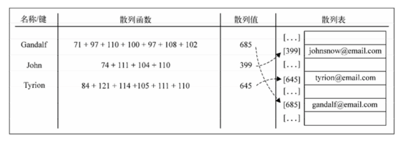
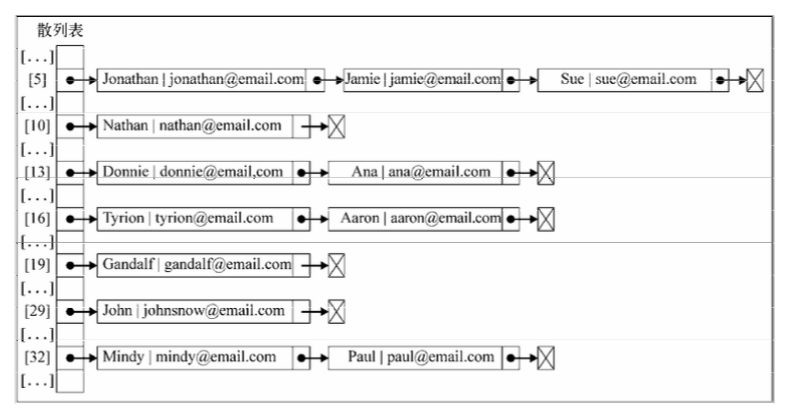
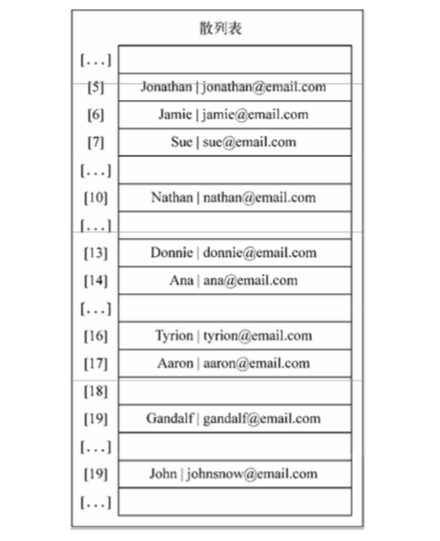

哈希表/散列表
===

## 数据结构
散列表也叫哈希表（`HashTable` 也叫 `HashMap`），是 Dictionary 类的一种散列表实现方式。

###（1）哈希表有何特殊之处
数组的特点是寻址方便，插入和删除困难；而链表的特点是寻址困难，插入和删除方便。哈希表正是综合了两者的优点，实现了寻址方便，插入删除元素也方便的数据结构

###（2）哈希表实现原理
哈希表就是把 `Key` 通过一个**固定的算法函数**既所谓的**哈希函数**转换成一个整型数字，然后将该数字对数组长度进行取余，取余结果就当作数组的下标，将 `value` 存储在以该数字为下标的数组空间里。而当使用哈希表进行查询的时候，就是再次使用哈希函数将 `key` 转换为对应的数组下标，并定位到该空间获取 `value`，如此一来，就可以充分利用到数组的定位性能进行数据定位

下面是将 `key` 中每个字母的 ASCII 值之和作为数组的索引（哈希函数）的图例：



###（3）数组的长度为什么选择质数

书中有如下说明：

> 散列函数的选择依赖于键值的数据类型。如果键是整数，最简单的散列函数就是以数组的长度对键取余。在一些情况下，比如数组的长度为 10，而键值都是 10 的倍数时，就不推荐使用这种方式了。这也是数组的长度为什么要是质数的原因之一。如果键是随机的整数，而散列函数应该更均匀地分布这些键，这种散列方式称为除留余数法。

## 哈希表的实现
我们为哈希表实现下面几个方法：

- `hashMethod` 哈希函数，将字符串转换成索引
- `put` 添加键值
- `get` 由键获取值
- `remove` 移除键

```js
class HashTable {
  constructor() {
    this._table = [];
  }

  // 哈希函数【社区中实践较好的简单哈希函数】
  hashMethod(key) {
    if (typeof key === 'number') {
      return key;
    }

    let hash = 5381;

    for (let i = 0; i < key.length; i += 1) {
      hash = hash * 33 + key.charCodeAt(i);
    }

    return hash % 1013;
  }

  put(key, value) {
    const pos = this.hashMethod(key);

    this._table[pos] = value;
  }

  get(key) {
    const pos = this.hashMethod(key);

    return this._table[pos];
  }

  remove(key) {
    const pos = this.hashMethod(key);

    delete this._table[pos];
  }

  print() {
    this._table.forEach((item, index) => {
      if (item !== undefined) {
        console.log(index + ' --> ' + item);
      }
    })
  }
}
```

当然了，一个简单的哈希函数，将不同的字符串转换成整数时，很有可能会出现多个不同字符串转换后对应同一个整数，这个就需要进行冲突的处理。

## 处理冲突的方法
###（1）分离链接
分离链接法包括为散列表的每一个位置创建一个链表并将元素存储在里面。它是解决冲突的最简单的方法，但是它在 HashTable 实例之外还需要额外的存储空间。



（2）线性探查

当想向表中某个位置加入一个新元素的时候，如果索引为 `index` 的位置已经被占据了，就尝试 `index+1` 的位置。如果 `index+1` 的位置也被占据了，就尝试 `index+2` 的位置，以此类推。


