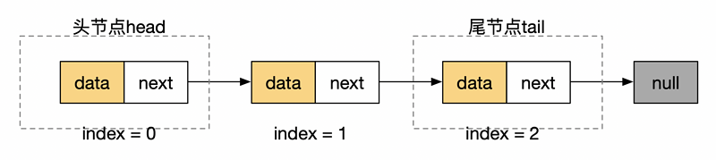
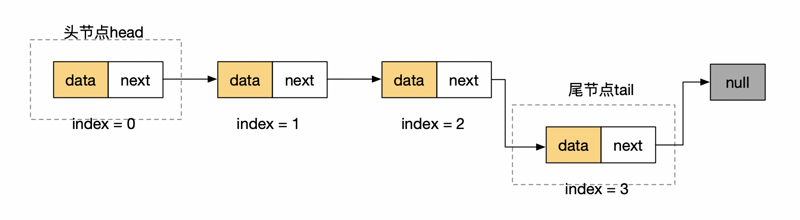
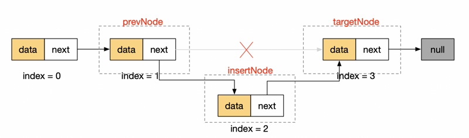
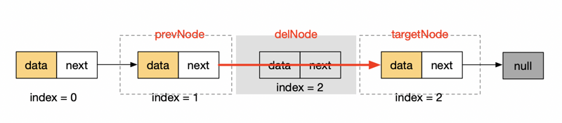
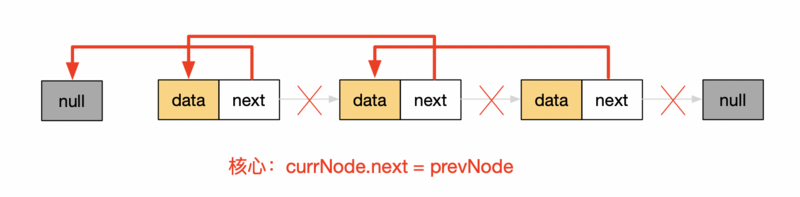
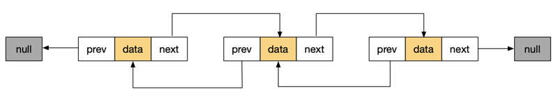
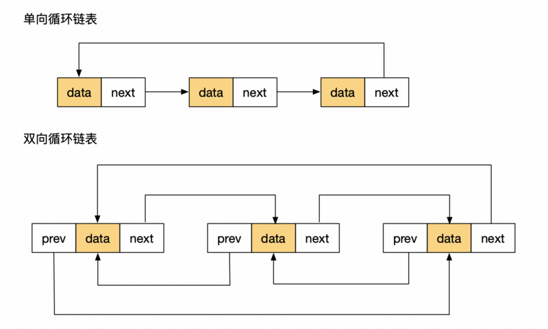

链表
===

## 链表数据结构
链表和数组都是用于存储有序元素的集合，但有几点大不相同：

1. 链表不同于数组，链表中的元素在内存中并不是连续放置的；
2. 链表添加或移除元素不需要移动其他元素；
3. 数组可以直接访问任何一个位置的元素，链表必须从表头开始迭代到指定位置访问；

下面是单链表的基本结构：



- 长度为 3 的单链表；
- 每个元素由一个存储元素本身 `data` 的节点和一个指向下一个元素的引用 `next`(也称指针或链接)组成；
- 尾节点的引用 `next` 指向为 `null`；

类比：寻宝游戏，你有一条线索，这条线索是指向寻找下一条线索的地点的指针。你顺着这条链接去下一个地点，得到另一条指向再下一处的线索。得到列表中间的线索的唯一办法，就是从起点(第一条线索)顺着列表寻找。

## 链表的实现
链表的实现不像之前介绍的栈和队列一般依赖于数组（至少我们目前是这样实现的），它必须自己构建类并组织逻辑实现。我们先创建一个 `Node` 类：
```js
// 节点基类
class Node {
  constructor(data) {
    this.data = data;
    this.next = null;
  }
}
```

一般单链表有以下几种方法：

- `append` 在链表尾部添加一个元素；
- `insert` 在指定位置插入元素；
- `removeAt` 在指定位置删除元素；
- `getNode` 获取指定位置的元素；
- `print` 打印整个链表；
- `indexOf` 查找链表中是否有某个元素，有则返回索引，没有则返回 -1；
- `getHead` 获取链表头部；
- `getTail` 获取链表尾部（有些并未实现尾部）；
- `size` 返回链表包含的元素个数；
- `clear` 清空链表；

```
// 初始化链表
class LinkedList {
  constructor() {
    this._head = null;
    this._tail = null;
    this._length = 0;
  }

  // 方法...
}
```

下面我们来实现几个重要的方法：

### 1.`append` 方法
在链表尾部添加一个新的元素可分为两种情况：

- 原链表中无元素，添加元素后，`head` 和 `tail` 均指向新元素；
- 原链表中有元素，更新 `tail` 元素（如下）；



代码实现
```js
// 在链表尾端添加元素
append(data) {
  const newNode = new Node(data);

  if (this._length === 0) {
    this._head = newNode;
    this._tail = newNode;
  } else {
    this._tail.next = newNode;
    this._tail = newNode;
  }

  this._length += 1;

  return true;
}
```

### 2.`print` 方法
为方便验证，我们先实现 `print` 方法。方法虽简单，这里却涉及到链表遍历精髓：
```js
// 打印链表
print() {
  let ret = [];
  // 遍历需从链表头部开始
  let currNode = this._head;

  // 单链表最终指向null，作为结束标志
  while (currNode) {
    ret.push(currNode.data);
    // 轮询至下一节点
    currNode = currNode.next;
  }

  console.log(ret.join(' --> '));
}

// 验证
const link = new LinkedList();
link.append(1);
link.append(2);
link.append(3);

link.print(); // 1 --> 2 --> 3
```

### 3.`getNode` 方法
获取指定索引位置的节点，依次遍历链表，直到指定位置返回：
```js
// 获取指定位置元素
getNode(index) {
  let currNode = this._head;
  let currIndex = 0;

  while (currIndex < index) {
    currIndex += 1;
    currNode = currNode.next;
  }

  return currNode;
}

// 验证【衔接上面的链表实例】
console.log(link.getNode(0));
// Node { data: 1, next: Node { data: 2, next: Node { data: 3, next: null } } }
console.log(link.getNode(3)); // null
```

### 4.`insert` 方法
插入元素，需要考虑三种情况

- 插入尾部，相当于 `append`；
- 插入首部，替代 `_head` 并指向原有头部元素；
- 中间，需要断开原有链接并重新组合（如下）；



代码实现
```js
// 在链表指定位置插入元素
insert(index, data) {
  // 不满足条件的索引值
  if (index < 0 || index > this._length) {
    return false;
  }

  // 插入尾部
  if (index === this._length) {
    return this.append(data);
  }

  const insertNode = new Node(data);

  if (index === 0) {
    // 插入首部
    insertNode.next = this._head;

    this._head = insertNode;
  } else {
    // 找到原有位置节点
    const prevTargetNode = this.getNode(index - 1);
    const targetNode = prevTargetNode.next;

    // 重塑节点连接
    prevTargetNode.next = insertNode;
    insertNode.next = targetNode;
  }

  this._length += 1;

  return true;
}

// 验证
link.insert(0, 0);
link.insert(4, 4);
link.insert(5, 5);
link.print(); // 0 --> 1 --> 2 --> 3 --> 4 --> 5
```

### 5.`removeAt` 方法
在指定位置删除元素同添加元素类似。

- 首部：重新定义 `_head`；
- 其他：找到目标位置的前后元素，重塑连接，如果目标位置为尾部，则重新定义 `_tail`；



代码实现
```js
// 在链表指定位置移除元素
removeAt(index) {
  if (index < 0 || index >= this._length) {
    return false;
  }

  if (index === 0) {
    this._head = this._head.next;
  } else {
    const prevNode = this.getNode(index - 1);
    const delNode = prevNode.next;
    const nextNode = delNode.next;

    // 若移除为最后一个元素
    if (!nextNode) {
      this._tail = prevNode;
    }

    prevNode.next = nextNode;
  }

  this._length -= 1;

  return true;
}

// 验证
link.removeAt(3);
link.print(); // 0 --> 1 --> 2 --> 4 --> 5
```

### 6.其它方法
完整的链表代码，可点此获取：
```js
// 判断数据是否存在于链表内，存在返回index，否则返回-1
indexOf(data) {
  let currNode = this._head;
  let index = 0;

  while (currNode) {
    if (currNode.data === data) return index;
    index += 1;
    currNode = currNode.next;
  }

  return -1;
}

getHead() {
  return this._head;
}

getTail() {
  return this._tail;
}

size() {
  return this._length;
}

isEmpty() {
  return !this._length;
}

clear() {
  this._head = null;
  this._tail = null;
  this._length = 0;
}
```

## 链表的应用
### 1.基于链表实现的 `Stack` 和 `Queue`
基于链表实现栈：
```js
class Stack {
  constructor() {
    this._link = new LinkedList();
  }
  push(item) {
    this._link.append(item);
  }
  pop() {
    const tailIndex = this._link - 1;
    return this._link.removeAt(tailIndex);
  }
  peek() {
    if (this._link.size() === 0) return undefined;
    return this._link.getTail().data;
  }
  size() {
    return this._link.size();
  }
  isEmpty() {
    return this._link.isEmpty();
  }
  clear() {
    this._link.clear()
  }
}
```

基于链表实现队列：
```js
class Queue {
  constructor() {
    this._link = new LinkedList();
  }
  enqueue(item) {
    this._link.append(item);
  }
  dequeue() {
    return this._link.removeAt(0);
  }
  head() {
    if (this._link.size() === 0) return undefined;
    return this._link.getHead().data;
  }
  tail() {
    if (this._link.size() === 0) return undefined;
    return this._link.getTail().data;
  }
  size() {
    return this._link.size();
  }
  isEmpty() {
    return this._link.isEmpty();
  }
  clear() {
    this._link.clear()
  }
}
```

### 2.链表翻转【面试常考】
####（1）迭代法
迭代法的核心就是 `currNode.next = prevNode`，然后从头部一次向后轮询：



代码实现
```js
reverse() {
  if (!this._head) {
    return false;
  }

  let prevNode = null;
  let currNode = this._head;

  while (currNode) {
    // 记录下一节点并重塑连接
    const nextNode = currNode.next;
    currNode.next = prevNode;
    // 轮询至下一节点
    prevNode = currNode;
    currNode = nextNode;
  }

  // 交换首尾
  let temp = this._tail;

  this._tail = this._head;
  this._head = temp;

  return true;
}
```

####（2）递归法
递归的本质就是执行到当前位置时，自己并不去解决，而是等下一阶段执行。直到递归终止条件，然后再依次向上执行：
```js
function _reverseByRecusive(node) {
  if (!node) {
    return null;
  }

  if (!node.next) {
    return node; // 递归终止条件
  }

  var reversedHead = _reverseByRecusive(node.next);
  node.next.next = node;
  node.next = null;
  
  return reversedHead;
};

_reverseByRecusive(this._head);
```

### 3.链表逆向输出
利用递归，反向输出：
```js
function _reversePrint(node){
  if(!node) {
    return;// 递归终止条件
  }

  _reversePrint(node.next);

  console.log(node.data);
};
```

## 双向链表和循环链表
### 1.双向链表
双向链表和普通链表的区别在于，在链表中，一个节点只有链向下一个节点的链接，而在双向链表中，链接是双向的：一个链向下一个元素，另一个链向前一个元素，如下图：



正是因为这种变化，使得链表相邻节点之间不仅只有单向关系，可以通过 `prev` 来访问当前节点的上一节点。相应的，双向循环链表的基类也有变化：
```js
class Node {
  constructor(data) {
    this.data = data;
    this.next = null;
    this.prev = null;
  }
}
```

继承单向链表后，最终的双向循环链表 `DoublyLinkedList` 如下【`prev` 对应的更改为 `NEW`】：
```js
class DoublyLinkedList extends LinkedList {
  constructor() {
    super();
  }

  append(data) {
    const newNode = new DoublyNode(data);

    if (this._length === 0) {
      this._head = newNode;
      this._tail = newNode;
    } else {
      newNode.prev = this._tail; // NEW

      this._tail.next = newNode;
      this._tail = newNode;
    }

    this._length += 1;

    return true;
  }

  insert(index, data) {
    if (index < 0 || index > this._length) {
      return false;
    }

    if (index === this._length) {
      return this.append(data);
    }

    const insertNode = new DoublyNode(data);

    if (index === 0) {
      insertNode.prev = null; // NEW
      this._head.prev = insertNode; // NEW
      insertNode.next = this._head;
      this._head = insertNode;
    } else {
      // 找到原有位置节点
      const prevTargetNode = this.getNode(index - 1);
      const targetNode = prevTargetNode.next;
      // 重塑节点连接
      prevTargetNode.next = insertNode;
      insertNode.next = targetNode;
      insertNode.prev = prevTargetNode; // NEW
      targetNode.prev = insertNode; // NEW
    }

    this._length += 1;
    return true;
  }

  removeAt(index) {
    if (index < 0 || index > this._length) {
      return false;
    }

    let delNode;

    if (index === 0) {
      delNode = this._head;

      this._head = this._head.next;
      this._head.prev = null; // NEW
    } else {
      const prevNode = this.getNode(index - 1);
      delNode = prevNode.next;
      const nextNode = delNode.next;

      // 若移除为最后一个元素
      if (!nextNode) {
        this._tail = prevNode;
        this._tail.next = null; // NEW
      } else {
        prevNode.next = nextNode; // NEW
        nextNode.prev = prevNode; // NEW
      }
    }

    this._length -= 1;
    return delNode.data;
  }
}
```

### 2.循环链表
循环链表可以像链表一样只有单向引用，也可以像双向链表一样有双向引用。循环链表和链 表之间唯一的区别在于，单向循环链表最后一个节点指向下一个节点的指针 `tail.next` 不是引用 `null`， 而是指向第一个节点 `head`，双向循环链表的第一个节点指向上一节点的指针 `head.prev` 不是引用 `null`，而是指向最后一个节点 `tail`。



## 总结
链表的实现较于栈和队列的实现复杂许多，同样的，链表的功能更加强大。

我们可以通过链表实现栈和队列，同样也可以通过链表来实现栈和队列的问题。

链表更像是数组一样的基础数据结构，同时也避免了数组操作中删除或插入元素对其他元素的影响。
