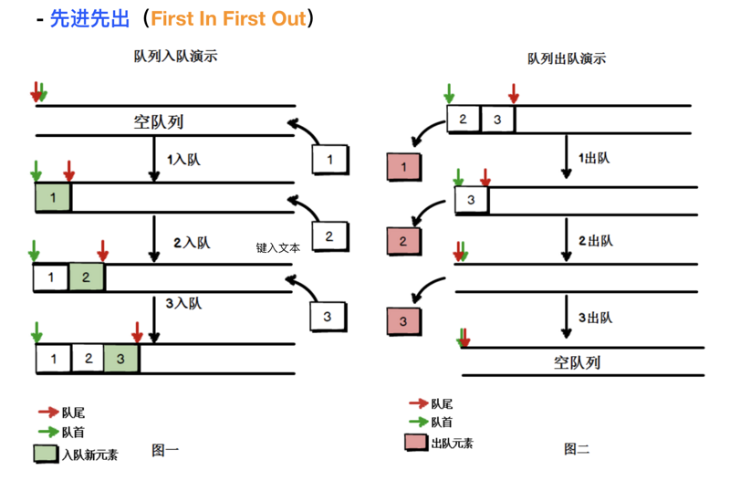

队列
===

## 队列数据结构
队列是遵循**先进先出（FIFO，也称为先来先服务）原则的一组有序的项。队列在尾部添加新元素，并从顶部移除元素。**最新添加的元素必须排在队列的末尾。



类比：日常生活中的购物排队，就是一个队列。

## 队列的实现
普通的队列常用的有以下几个方法：

- `enqueue` 向队列尾部添加一个(或多个)新的项
- `dequeue` 移除队列的第一(即排在队列最前面的)项，并返回被移除的元素
- `head` 返回队列第一个元素，队列不做任何变动
- `tail` 返回队列最后一个元素，队列不做任何变动
- `isEmpty` 队列内无元素返回 `true`，否则返回 `false`
- `size` 返回队列内元素个数
- `clear` 清空队列

```js
class Queue {
  constructor() {
    this._items = [];
  }

  enqueue(item) {
    this._items.push(item);
  }

  dequeue() {
    return this._items.shift();
  }

  head() {
    return this._items[0];
  }

  tail() {
    return this._items[this._items.length - 1];
  }

  isEmpty() {
    return !this._items.length;
  }

  size() {
    return this._items.length;
  }

  clear() {
    this._items = [];
  }
}
```

与栈类比，栈仅能操作其头部，队列则首尾均能操作，但仅能在头部出尾部进。当然，也印证了上面的话：栈和队列并不关心其内部元素细节，也无法直接操作非首尾元素。

## 队列的应用
### 约瑟夫环（普通模式）
要求: 有一个数组a[100]存放0~99；要求每隔两个数删掉一个数，到末尾时循环至开头继续进行，求最后一个被删掉的数。

分析: 按数组创建队列，依次判断元素是否满足为指定位置的数，如果不是则enqueue到尾部，否则忽略，当仅有一个元素时便输出
```js
// 创建一个长度为100的数组
const arr_100 = Array.from({ length: 100 }, (_, i) => i*i);

function delRing(list) {
  const queue = new Queue();

  list.forEach(e => { 
    queue.enqueue(e); 
  });
  
  let index = 0;

  while (queue.size() !== 1) {
    const item = queue.dequeue();
    index += 1;

    if (index % 3 !== 0) {
      queue.enqueue(item);
    }
  }

  return queue.tail();
}

console.log(delRing(arr_100)); // 8100 此时index=297
```

### 菲波那切数列（普通模式）
要求: 使用队列计算斐波那契数列的第n项
分析: 斐波那契数列的前两项固定为1，后面的项为前两项之和，依次向后，这便是斐波那契数列。
```js
function fibonacci(n) {
  const queue = new Queue();
  queue.enqueue(1);
  queue.enqueue(1);
  
  let index = 0;

  while(index < n - 2) {
    index += 1;
    // 出队列一个元素
    const delItem = queue.dequeue();
    // 获取头部值
    const headItem = queue.head();
    const nextItem = delItem + headItem;

    queue.enqueue(nextItem);
  }
  
  return queue.tail();
}

console.log(fibonacci(9)); // 34
```

### 用队列实现一个栈
要求: 用两个队列实现一个栈
分析: 使用队列实现栈最主要的是在队列中找到栈顶元素并对其操作。具体的思路如下：

1. 两个队列，一个备份队列 `emptyQueue`，一个是数据队列 `dataQueue`；
2. 在确认栈顶时，依次dequeue至备份队列，置换备份队列和数据队列的引用即可

```js
class QueueStack {
  constructor() {
    this.queue_1 = new Queue();
    this.queue_2 = new Queue();
    this._dataQueue = null; // 放数据的队列
    this._emptyQueue = null; // 空队列,备份使用
  }

  // 确认哪个队列放数据,哪个队列做备份空队列
  _initQueue() {
    if (this.queue_1.isEmpty() && this.queue_2.isEmpty()) {
      this._dataQueue = this.queue_1;
      this._emptyQueue = this.queue_2;
    } else if (this.queue_1.isEmpty()) {
      this._dataQueue = this.queue_2;
      this._emptyQueue = this.queue_1;
    } else {
      this._dataQueue = this.queue_1;
      this._emptyQueue = this.queue_2;
    }
  };

  push(item) {
    this.init_queue();
    this._dataQueue.enqueue(item);
  };

  peek() {
    this.init_queue();
    return this._dataQueue.tail();
  }

  pop() {
    this.init_queue();
    while (this._dataQueue.size() > 1) {
      this._emptyQueue.enqueue(this._dataQueue.dequeue());
    }
    return this._dataQueue.dequeue();
  };
};
```

同样的，一个队列也能实现栈的基本功能
```js
class QueueStack {
  constructor() {
    this.queue = new Queue();
  }

  push(item) {
    this.queue.enqueue(item);
  }

  pop() {
    // 向队列末尾追加 队列长度-1 次，后弹出队列头部
    for(let i = 1; i < this.queue.size(); i += 1) {
      this.queue.enqueue(this.queue.dequeue());
    }
    
    return this.queue.dequeue();
  }

  peek() {
    return this.queue.tail();
  }
}
```

数据结构并没有之前想象中那么神秘，它们只是规定了这类数据结构的操作方式：**栈只能对栈顶进行操作，队列只能在尾部添加在头部弹出；且它们不关心内部的元素状态**。
