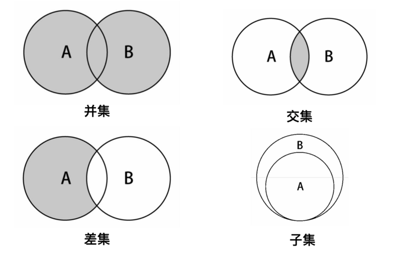

集合 Set
===

### 集合数据结构

集合 `set` 是一种包含不同元素的数据结构。集合中的元素成为成员。集合的两个最重要特性是：**集合中的成员是无序的；集合中不允许相同成员存在**。

计算机中的集合与数学中集合的概念相同，有一些概念我们必须知晓：

- 不包含任何成员的集合称为空集；包含一切可能的成员为**全集**；
- 如果两个成员完全相同，则称为两个集合相等；
- 如果一个集合中所有的成员都属于另一个集合，则前一个集合被称为后一个集合的子集；

另外还有交集/并集/差集，下面会一一实现。

### 集合的实现

一般集合包含下面几个方法：

- `add` 向集合添加一个新的项；
- `remove` 从集合移除一个值；
- `has` 如果值在集合中，返回 `true`，否则返回 `false`；
- `clear` 移除集合中的所有项；
- `size` 返回集合所包含元素的数量，与数组的 `length` 属性类似；
- `values` 返回一个包含集合中所有值的数组；
- `union` 两个集合的并集；
- `intersection` 两个集合的交集；
- `difference` 两个集合的差集；
- `isSubsetOf` 判断是否为子集；

下面将基于对象实现基础的集合（数组和队列也可实现集合，点击查看）。

```js
class Set {
  constructor() {
    this._items = {};
    this._length = 0;
  }

  // 添加成员时，如果已有成员则不操作。以[value: value]的形式存储在对象中
  add(value) {
    if (this.has(value)) {
      return false;
    }

    this._items[value] = value;
    this._length += 1;

    return true;
  }

  // 移除成员时，如果没有对应成员则不操作
  remove(value) {
    if (!this.has(value)) {
      return false;
    }

    delete this._items[value];
    this._length -= 1;

    return true;
  }

  values() {
    return Object.values(this._items);
  }

  has(value) {
    return this._items.hasOwnProperty(value);
  }

  clear() {
    this._items = {};
    this._length = 0;
  }

  size() {
    return this._length;
  }

  isEmpty() {
    return !this._length;
  }
}
```



#### （1）并集的实现
将两个集合中的元素依次添加至新的集合中，并返回改集合：

```js
// 并集
union(otherSet) {
  const unionSet = new Set();

  const values = this.values();
  values.forEach(item => unionSet.add(item));

  const otherValues = otherSet.values();
  otherValues.forEach(item => unionSet.add(item));

  return unionSet;
}
```

#### （2）交集的实现
以集合 A 作为参考，遍历集合 B 依次对比成员，B 中的成员存在 A 中则添加至新集合 C 中，最后返回 C：

```js
// 交集
intersection(otherSet) {
  const intersectionSet = new Set();

  const values = this.values();
  values.forEach(item => {
    if (otherSet.has(item)) {
      intersectionSet.add(item);
    }
  })

  return intersectionSet;
}
```

#### （3）差集的实现
以集合 A 作为参考，遍历集合 B 依次对比成员，B 中的成员不存在 A 中则添加至新集合 C 中，最后返回 C：

```js
// 差集
difference(otherSet) {
  const differenceSet = new Set();

  const values = this.values();
  values.forEach(item => {
    if (!otherSet.has(item)) {
      differenceSet.add(item);
    }
  })

  return differenceSet;
}
```

注意：`A.difference(B)` 与 `B.difference(A)` 计算参考不同。

#### （4）子集的实现
以集合 A 作为参考，遍历集合 B 依次对比成员，B 中的所有成员均存在 A 中则为其子集，否则不是。

```js
// 子集
isSubsetOf(otherSet) {
  if (this.size() > otherSet.size()) return false;

  const values = this.values();
  for (let i = 0; i < values.length; i += 1) {
    const item = values[i];
    if (!otherSet.has(item)) return false;
  }

  return true;
}
```

### ES6 中的 Set

ES6 中提供了新的数据结构 Set，它类似于数组，但是成员的值都是唯一的，没有重复的值。

提供了一下几个方法：

- `add(value)` 添加某个值，返回Set结构本身
- `delete(value)` 删除某个值，返回一个布尔值，表示删除是否成功
- `has(value)` 返回一个布尔值，表示该值是否为Set的成员
- `clear()` 清除所有成员，没有返回值
- `size` 属性，返回成员总数

创建：

- 直接通过数组创建：`new Set([1,2,3,4])`
- 先实例再添加：`const set = new Set(); set.add(1);`

遍历：

- `keys()` 返回键名的遍历器
- `values()` 返回键值的遍历器
- `entries()` 返回键值对的遍历器
- `forEach()/for-of` 使用回调函数遍历每个成员
