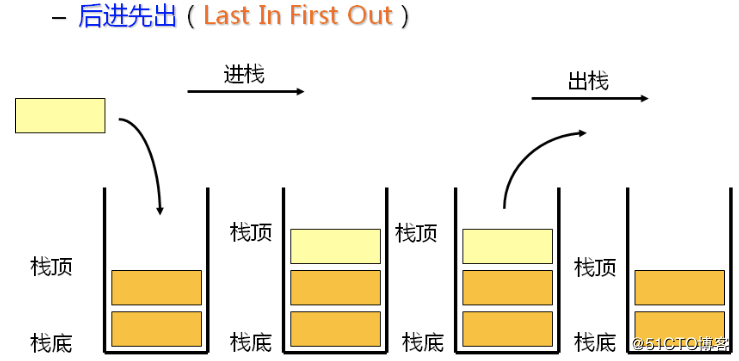

堆栈
===

## 栈数据结构

栈是一种遵循**后进先出（LIFO）**原则的有序集合。新添加的或待删除的元素都保存在栈的同一端，称作**栈顶**，另一端就叫**栈底**。在栈里，新元素都接近栈顶，旧元素都接近栈底。



> 类比生活中的物件：一摞书或者推放在一起的盘子，就是一个栈。

## 栈的实现

普通的栈常用的有以下几个方法：

- `push` 添加一个（或几个）新元素到栈顶
- `pop` 溢出栈顶元素，同时返回被移除的元素
- `peek` 返回栈顶元素，不对栈做修改
- `isEmpty` 栈内无元素返回 `true`，否则返回 `false`
- `size` 返回栈内元素个数
- `clear` 清空栈

```js
class Stack {
  constructor() {
    this._items = []; // 储存数据
  }

  // 向栈内压入一个元素
  push(item) {
    this._items.push(item);
  }

  // 把栈顶元素弹出
  pop() {
    return this._items.pop();
  }

  // 返回栈顶元素
  peek() {
    return this._items[this._items.length - 1];
  }

  // 判断栈是否为空
  isEmpty() {
    return !this._items.length;
  }

  // 栈元素个数
  size() {
    return this._items.length;
  }

  // 清空栈
  clear() {
    this._items = [];
  }
}
```

## 栈的应用

### 十进制转任意进制

要求: 给定一个函数，输入目标数值和进制基数，输出对应的进制数（最大为16进制）

```js
baseConverter(10, 2) ==> 1010
baseConverter(30, 16) ==> 1E
```

分析: 进制转换的本质：将目标值一次一次除以进制基数，得到的取整值为新目标值，记录下余数，直到目标值小于0，最后将余数逆序组合即可。利用栈，记录余数入栈，组合时出栈

```js
// 进制转换
function baseConverter(delNumber, base) {
  const stack = new Stack();
  let rem = null;
  let ret = [];
  // 十六进制中需要依次对应A~F
  const digits = '0123456789ABCDEF';

  while (delNumber > 0) {
    rem = Math.floor(delNumber % base);
    stack.push(rem);
    delNumber = Math.floor(delNumber / base);
  }

  while (!stack.isEmpty()) {
    ret.push(digits[stack.pop()]);
  }

  return ret.join('');
}

console.log(baseConverter(100345, 2)); //输出11000011111111001
console.log(baseConverter(100345, 8)); //输出303771
console.log(baseConverter(100345, 16)); //输出187F9
```

### 逆波兰表达式计算

要求: 逆波兰表达式，也叫后缀表达式，它将复杂表达式转换为可以依靠简单的操作得到计算结果的表达式，例如 `(a+b)*(c+d)` 转换为 `a b + c d + *`

```js
["4", "13", "5", "/", "+"] ==> (4 + (13 / 5)) = 6
["10", "6", "9", "3", "+", "-11", "*", "/", "*", "17", "+", "5", "+"]
==> ((10 * (6 / ((9 + 3) * -11))) + 17) + 5
```

分析: 以符号为触发节点，一旦遇到符号，就将符号前两个元素按照该符号运算，并将新的结果入栈，直到栈内仅一个元素

```js
function isOperator(str) {
  return ['+', '-', '*', '/'].includes(str);
}
// 逆波兰表达式计算
function clacExp(exp) {
  const stack = new Stack();

  for (let i = 0; i < exp.length; i++) {
    const one = exp[i];

    if (isOperator(one)) {
      const operatNum1 = stack.pop();
      const operatNum2 = stack.pop();
      const expStr = `${operatNum2}${one}${operatNum1}`;
      const res = eval(expStr);

      stack.push(res);
    } else {
      stack.push(one);
    }
  }

  return stack.peek();
}

console.log(clacExp(["4", "13", "5", "/", "+"])); // 6.6
```

### 利用普通栈实现一个有 `min` 方法的栈

思路: 使用两个栈来存储数据，其中一个命名为 `dataStack`，专门用来存储数据，另一个命名为 `minStack`，专门用来存储栈里最小的数据。始终保持两个栈中的元素个数相同，压栈时判别压入的元素与 `minStack` 栈顶元素比较大小，如果比栈顶元素小，则直接入栈，否则复制栈顶元素入栈；弹出栈顶时，两者均弹出即可。这样 `minStack` 的栈顶元素始终为最小值。

```js
class MinStack {
  constructor() {
    this._dataStack = new Stack();
    this._minStack = new Stack();
  }

  push(item) {
    this._dataStack.push(item);
    
    // 为空或入栈元素小于栈顶元素，直接压入该元素
    if (this._minStack.isEmpty() || this._minStack.peek() > item) {
      this._minStack.push(item);
    } else {
      this._minStack.push(this._minStack.peek());
    }
  }

  pop() {
    this._dataStack.pop();
    return this._minStack.pop();
  }

  min() {
    return this._minStack.peek();
  }
}

const minstack = new MinStack();

minstack.push(3);
minstack.push(4);
minstack.push(8);
console.log(minstack.min()); // 3
minstack.push(2);
console.log(minstack.min()); // 2
```
