# HTML5 Canvas

定义一个 canvas：

```html
<canvas id="myCanvas" width="300" height="300"></canvas>
```

以下所有的实例都以此为准。

## 1. fillStyle 属性

`fillStyle` 属性设置或返回用于填充绘画的颜色、渐变或模式，其默认值为 `#000000`。

JavaScript 语法：

```js
context.fillStyle = color | gradient | pattern;
```

其属性：

- color：指示绘图填充色的 CSS 颜色值，默认值是 #000000；
- gradient：用于填充绘图的渐变对象（线性或放射性）；
- pattern：用于填充绘图的 pattern 对象。

- 实例 1

定义用蓝色填充的矩形：

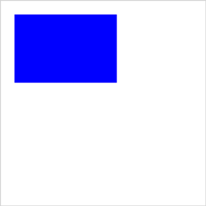

JavaScript：

```js
var canvas = document.getElementById('myCanvas');
var ctx = canvas.getContext('2d');

ctx.fillStyle = '#0000ff';
ctx.fillRect(20, 20, 150, 100);
```

- 实例 2

定义从上到下的渐变，作为矩形的填充样式：

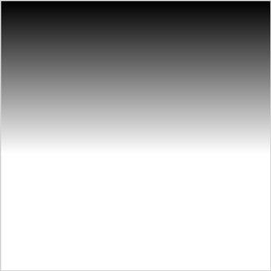

JavaScript：

```js
var canvas = document.getElementById('myCanvas');
var ctx = canvas.getContext('2d');

var my_gradient = ctx.createLinearGradient(0, 0, 0, 170);
my_gradient.addColorStop(0, 'black');
my_gradient.addColorStop(1, 'white');

ctx.fillStyle = my_gradient;
ctx.fillRect(0, 0, 300, 300);
```

- 实例 3

定义从黑到红到白的的渐变，作为矩形的填充样式：

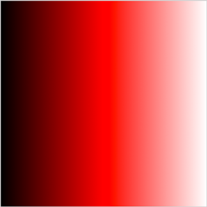

JavaScript：

```js
var canvas = document.getElementById('myCanvas');
var ctx = canvas.getContext('2d');

var my_gradient = ctx.createLinearGradient(0, 0, 300, 0);
my_gradient.addColorStop(0, 'black');
my_gradient.addColorStop(0.5, 'red');
my_gradient.addColorStop(1, 'white');

ctx.fillStyle = my_gradient;
ctx.fillRect(0, 0, 300, 300);
```

- 实例 4

用到的图片：


使用图像来填充绘图：

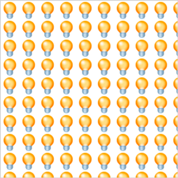

JavaScript：

```js
var canvas = document.getElementById('myCanvas');
var ctx = canvas.getContext('2d');
ctx.clearRect(0, 0, canvas.width, canvas.height);

var img = document.getElementById('lamp');
var pat = ctx.createPattern(img, 'repeat');

ctx.rect(0, 0, 300, 300);
ctx.fillStyle = pat;
ctx.fill();
```

## 2. strokeStyle 属性

`strokeStyle` 属性设置或返回用于笔触的颜色、渐变或模式，默认值为 `#000000`。

JavaScript 语法：

```js
context.strokeStyle = color(gradient, pattern);
```

其属性值：

- color：指示绘图笔触颜色的 CSS 颜色值。默认值是 #000000；
- gradient：用于填充绘图的渐变对象（线性或放射性）；
- pattern：用于创建 pattern 笔触的 pattern 对象。

- 实例 5

绘制一个矩形，使用渐变笔触：

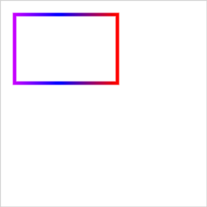

JavaScript：

```js
var canvas = document.getElementById('myCanvas');
var ctx = canvas.getContext('2d');

var gradient = ctx.createLinearGradient(0, 0, 170, 0);
gradient.addColorStop('0', 'magenta');
gradient.addColorStop('0.5', 'blue');
gradient.addColorStop('1.0', 'red');

// 用渐变进行填充
ctx.strokeStyle = gradient;
ctx.lineWidth = 5;
ctx.strokeRect(20, 20, 150, 100);
```

- 实例 6

用一个渐变笔触来写文本：

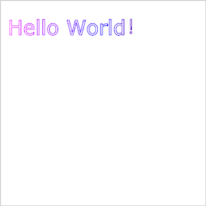

JavaScript：

```js
var canvas = document.getElementById('myCanvas');
var ctx = canvas.getContext('2d');

ctx.font = '30px Verdana';
// 创建渐变
var gradient = ctx.createLinearGradient(0, 0, c.width, 0);
gradient.addColorStop('0', 'magenta');
gradient.addColorStop('0.5', 'blue');
gradient.addColorStop('1.0', 'red');

// 用渐变进行填充
ctx.strokeStyle = gradient;
ctx.strokeText('Hello World！', 10, 50);
```

## 3. shadowColor 属性、shadowBlur 属性、shadowOffsetX 和 shadowOffsetY 属性

`shadowColor` 属性设置或返回用于阴影的颜色，默认值为 `#000000`。

JavaScript 语法：

```js
context.shadowColor = color;
```

> 请将 shadowColor 属性与 shadowBlur 属性一起使用，来创建阴影，通过使用 shadowOffsetX 和 shadowOffsetY 属性来调节阴影效果。

`shadowBlur` 属性设置或返回阴影的模糊级数，默认值为 `#000000`。

JavaScript 语法：

```js
context.shadowBlur = number;
```

`shadowOffsetX` 属性设置或返回形状与阴影的水平距离，`shadowOffsetY` 属性设置或返回形状与阴影的垂直距离。

- 实例 7

绘制一个带有黑色阴影的蓝色矩形：

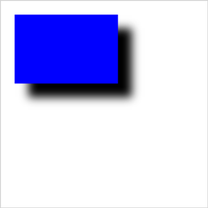

JavaScript：

```js
var canvas = document.getElementById('myCanvas');
var ctx = canvas.getContext('2d');

ctx.shadowBlur = 20;
ctx.shadowOffsetX = 20;
ctx.shadowOffsetY = 20;
ctx.shadowColor = 'black';

ctx.fillStyle = 'blue';
ctx.fillRect(20, 20, 150, 100);
```

## 4. createLinearGradient() 方法

`createLinearGradient()` 方法创建线性的渐变对象，渐变可用于填充矩形、圆形、线条、文本等等。

> 请使用该对象作为 `strokeStyle` 或 `fillStyle` 属性的值。

> 请使用 `addColorStop()` 方法规定不同的颜色，以及在 `gradient` 对象中的何处定位颜色。

语法：

```js
context.createLinearGradient(x0, y0, x1, y1);
```

## 5. createPattern() 方法

`createPattern()` 方法在指定的方向内重复指定的元素，元素可以是图片、视频，或者其他 `<canvas>`元素，被重复的元素可用于绘制/填充矩形、圆形或线条等等。

语法：

```js
context.createPattern(image, 'repeat|repeat-x|repeat-y|no-repeat');
```

## 6. createRadialGradient() 方法

`createLinearGradient()` 方法创建放射状/圆形渐变对象，渐变可用于填充矩形、圆形、线条、文本等等。

语法：

```js
context.createRadialGradient(x0, y0, r0, x1, y1, r1);
```

`createLinearGradient()` 方法的使用，参考 `createLinearGradient()`。

- 实例 8

绘制一个矩形，并用放射状/圆形渐变进行填充：

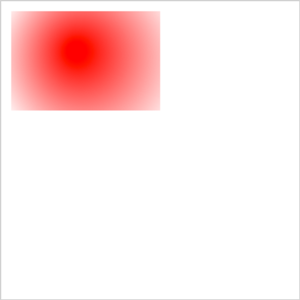

JavaScript：

```js
var canvas = document.getElementById('myCanvas');
var ctx = canvas.getContext('2d');

var grd = ctx.createRadialGradient(75, 50, 5, 90, 60, 100);
grd.addColorStop(0, 'red');
grd.addColorStop(1, 'white');

// Fill with gradient
ctx.fillStyle = grd;
ctx.fillRect(10, 10, 150, 100);
```

## 7. addColorStop() 方法

`addColorStop()` 方法规定 `gradient` 对象中的颜色和位置。该方法与 `createLinearGradient()` 或 `createRadialGradient()` 一起使用。

> 可以多次调用 addColorStop() 方法来改变渐变。如果您不对 gradient 对象使用该方法，那么渐变将不可见。为了获得可见的渐变，您需要创建至少一个色标。

语法：

```js
gradient.addColorStop(stop, color);
```

- 实例 9

通过多个 addColorStop() 方法来定义渐变：

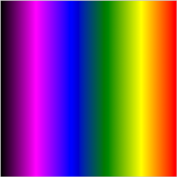

JavaScript：

```js
var c = document.getElementById('myCanvas');
var ctx = c.getContext('2d');

var grd = ctx.createLinearGradient(0, 0, 300, 0);
grd.addColorStop(0, 'black');
grd.addColorStop('0.2', 'magenta');
grd.addColorStop('0.4', 'blue');
grd.addColorStop('0.6', 'green');
grd.addColorStop('0.8', 'yellow');
grd.addColorStop(1, 'red');

ctx.fillStyle = grd;
ctx.fillRect(0, 0, 300, 300);
```

## 8. lineCap 属性

`lineCap` 属性设置或返回线条末端线帽的样式。

JavaScript 语法：

```js
context.lineCap = 'butt|round|square';
```

属性值：

- butt，默认值，向线条的每个末端添加平直的边缘；
- round，向线条的每个末端添加圆形线帽；
- square，向线条的每个末端添加正方形线帽。

> "round" 和 "square" 会使线条略微变长。

## 9. lineJoin 属性

lineJoin 属性设置或返回所创建边角的类型，当两条线交汇时。

JavaScript 语法：

```js
context.lineJoin = 'bevel|round|miter';
```

属性值：

- bevel，创建斜角；
- round，创建圆角；
- miter，默认值，创建尖角。

- 实例 10

绘制圆形的结束线帽，并实现当两条线条交汇时，创建圆形边角：

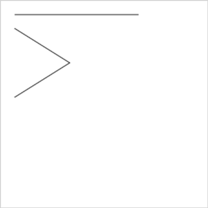

JavaScript：

```js
var canvas = document.getElementById('myCanvas');
mardown;
var ctx = canvas.getContext('2d');

ctx.beginPath();
ctx.lineCap = 'round';
ctx.moveTo(20, 20);
ctx.lineTo(200, 20);
ctx.stroke();

ctx.beginPath();
ctx.lineJoin = 'round';
ctx.moveTo(20, 40);
ctx.lineTo(100, 90);
ctx.lineTo(20, 140);
ctx.stroke();
```

## 10. lineWidth 属性

`lineWidth` 属性设置或返回当前线条的宽度，以像素计，默认值为 1。

JavaScript 语法：

```js
context.lineWidth = number;
```

## 11. miterLimit 属性

`miterLimit` 属性设置或返回最大斜接长度。

JavaScript 语法：

```js
context.miterLimit = number;
```

> 只有当 `lineJoin` 属性为 "miter" 时，`miterLimit` 才有效。

边角的角度越小，斜接长度就会越大。如果斜接长度超过 `miterLimit` 的值，边角会以 `lineJoin` 的 "bevel" 类型来显示。

- 实例 11

以最大斜接长度 5 绘制线条，组成四角星：

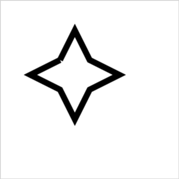

JavaScript：

```js
var canvas = document.getElementById('myCanvas');
var ctx = canvas.getContext('2d');

ctx.lineWidth = 10;
ctx.lineJoin = 'miter';
ctx.miterLimit = 5;

ctx.moveTo(100, 100);
ctx.lineTo(125, 50);
ctx.lineTo(150, 100);
ctx.lineTo(150, 100);
ctx.lineTo(200, 125);
ctx.lineTo(150, 150);
ctx.lineTo(125, 200);
ctx.lineTo(100, 150);
ctx.lineTo(50, 125);
ctx.lineTo(100, 100);

ctx.stroke();
```

## 11. rect() 方法

`rect()` 方法创建矩形。

JavaScript 语法：

```js
context.rect(x, y, width, height);
```

其中，x 为矩形左上角的 x 坐标，y 为矩形左上角的 y 坐标。

## 12. fillRect() 方法

`fillRect()` 方法绘制“已填色”的矩形，默认的填充颜色是黑色。

JavaScript 语法：

```js
context.fillRect(x, y, width, height);
```

> 请使用 `fillStyle` 属性来设置用于填充绘图的颜色、渐变或模式。

## 13. strokeRect() 方法

`strokeRect()` 方法绘制矩形（不填色），笔触的默认颜色是黑色。

JavaScript 语法：

```js
context.strokeRect(x, y, width, height);
```

> 请使用 `strokeStyle` 属性来设置笔触的颜色、渐变或模式。

## 14. clearRect() 方法

`clearRect()` 方法清空给定矩形内的指定像素。

JavaScript 语法：

```js
context.clearRect(x, y, width, height);
```

## 15. fill() 方法

`fill()` 方法填充当前的图像（路径）。默认颜色是黑色。

JavaScript 语法：

```js
context.fill();
```

> 请使用 `fillStyle` 属性来填充另一种颜色/渐变。

## 16. stroke() 方法

`stroke()` 方法会实际地绘制出通过 `moveTo()` 和 `lineTo()` 方法定义的路径，默认颜色是黑色。

JavaScript 语法：

```js
context.stroke();
```

> 请使用 `strokeStyle` 属性来绘制另一种颜色/渐变。

## 17. beginPath() 方法

`beginPath()` 方法开始一条路径，或重置当前的路径。

JavaScript 语法：

```js
context.beginPath();
```

## 18. clip() 方法

`clip()` 方法从原始画布中剪切任意形状和尺寸。

JavaScript 语法：

```js
context.clip();
```

> 一旦剪切了某个区域，则所有之后的绘图都会被限制在被剪切的区域内（不能访问画布上的其他区域）。也可以在使用 `clip()` 方法前通过使用 `save()` 方法对当前画布区域进行保存，并在以后的任意时间对其进行恢复（通过 `restore()` 方法）。

- 实例 12

从画布中剪切 200\*120 像素的矩形区域。然后，绘制绿色矩形。只有被剪切区域内的绿色矩形部分是可见的：

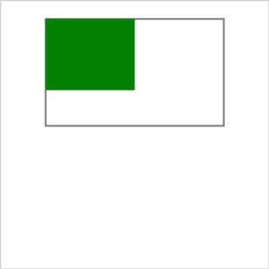

JavaScript：

```js
var canvas = document.getElementById('myCanvas');
var ctx = canvas.getContext('2d');

// 剪切矩形区域
ctx.rect(50, 20, 200, 120);
ctx.stroke();
ctx.clip();

// 在 clip() 之后绘制绿色矩形
ctx.fillStyle = 'green';
ctx.fillRect(0, 0, 150, 100);
```

## 19. quadraticCurveTo() 方法

`quadraticCurveTo()` 方法通过使用表示二次贝塞尔曲线的指定控制点，向当前路径添加一个点。

JavaScript 语法：

```js
context.quadraticCurveTo(cpx, cpy, x, y);
```

二次贝塞尔曲线需要两个点，第一个点是用于二次贝塞尔计算中的控制点，第二个点是曲线的结束点。曲线的开始点是当前路径中最后一个点。如果路径不存在，那么请使用 `beginPath()` 和 `moveTo()` 方法来定义开始点。


- 实例 13

绘制一条二次贝塞尔曲线：

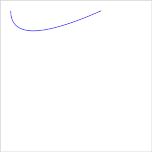

JavaScript：

```js
var canvas = document.getElementById('myCanvas');
var ctx = canvas.getContext('2d');
ctx.beginPath();
ctx.moveTo(20, 20);
ctx.quadraticCurveTo(20, 100, 200, 20);
ctx.strokeStyle = 'blue';
ctx.stroke();
```

## 20. bezierCurveTo() 方法

`bezierCurveTo()` 方法通过使用表示三次贝塞尔曲线的指定控制点，向当前路径添加一个点。

JavaScript 语法：

```js
context.bezierCurveTo(cp1x, cp1y, cp2x, cp2y, x, y);
```

三次贝塞尔曲线需要三个点，前两个点是用于三次贝塞尔计算中的控制点，第三个点是曲线的结束点。曲线的开始点是当前路径中最后一个点。如果路径不存在，那么请使用 `beginPath()` 和 `moveTo()` 方法来定义开始点。


- 开始点：moveTo(20,20)
- 控制点 1：bezierCurveTo(20,100,200,100,200,20)
- 控制点 2：bezierCurveTo(20,100,200,100,200,20)
- 结束点：bezierCurveTo(20,100,200,100,200,20)

## 21. arc() 方法

`arc()` 方法创建弧/曲线（用于创建圆或部分圆）。

JavaScript 语法：

```js
context.arc(x, y, r, sAngle, eAngle, counterclockwise);
```

> 如需通过 `arc()` 来创建圆，请把起始角设置为 0，结束角设置为 2\*Math.PI。


- 中心：arc(100,75,50,0*Math.PI,1.5*Math.PI)
- 起始角：arc(100,75,50,0,1.5\*Math.PI)
- 结束角：arc(100,75,50,0*Math.PI,1.5*Math.PI)

创建一个圆形：

```js
var canvas = document.getElementById('myCanvas');
var ctx = canvas.getContext('2d');

ctx.beginPath();
ctx.arc(100, 75, 50, 0, 2 * Math.PI);
ctx.stroke();
```

## 22. arcTo() 方法

arcTo() 方法在画布上创建介于两个切线之间的弧/曲线。

JavaScript 语法：

```js
context.fillRect(x1, y1, x2, y2, r);
```

参数值

- x1，弧的起点的 x 坐标
- y1，弧的起点的 y 坐标
- x2，弧的终点的 x 坐标
- y2，弧的终点的 y 坐标
- r，弧的半径

- 实例 14

在画布上创建介于两个切线之间的弧：

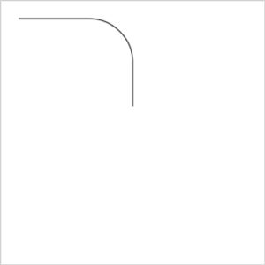

JavaScript：

```js
var canvas = document.getElementById('myCanvas');
var ctx = canvas.getContext('2d');

ctx.beginPath();
ctx.beginPath();
ctx.moveTo(20, 20); // 创建开始点
ctx.lineTo(100, 20); // 创建水平线
ctx.arcTo(150, 20, 150, 70, 50); // 创建弧
ctx.lineTo(150, 120); // 创建垂直线
ctx.stroke(); // 进行绘制
```

## 23. isPointInPath() 方法

`isPointInPath()` 方法返回 true，如果指定的点位于当前路径中；否则返回 false。

JavaScript 语法：

```js
context.isPointInPath(x, y);
```

## 24. scale() 方法

`scale()` 方法缩放当前绘图，更大或更小。

JavaScript 语法：

```js
context.scale(scalewidth, scaleheight);
```

> 如果对绘图进行缩放，所有之后的绘图也会被缩放。定位也会被缩放。如果 `scale(2,2)`，那么绘图将定位于距离画布左上角两倍远的位置。

- 实例 15

绘制一个矩形；放大到 200%，再次绘制矩形；放大到 200%，然后再次绘制矩形；放大到 200%，再次绘制矩形：

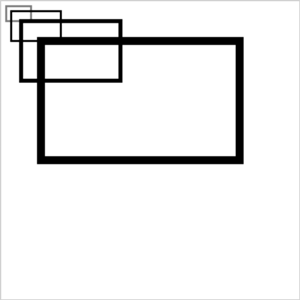

JavaScript：

```js
var canvas = document.getElementById('myCanvas');
var ctx = canvas.getContext('2d');

ctx.strokeRect(5, 5, 25, 15);
ctx.scale(2, 2);
ctx.strokeRect(5, 5, 25, 15);
ctx.scale(2, 2);
ctx.strokeRect(5, 5, 25, 15);
ctx.scale(2, 2);
ctx.strokeRect(5, 5, 25, 15);
```

## 25. rotate() 方法

`rotate()` 方法旋转当前的绘图。

JavaScript 语法：

```js
context.rotate(angle);
```

参数值

- angle，旋转角度，以弧度计，angle = degrees\*Math.PI/180。

## 26. translate() 方法

`translate()` 方法重新映射画布上的 (0,0) 位置。

JavaScript 语法：

```js
context.translate(x, y);
```

> 当在 `translate()` 之后调用诸如 `fillRect()` 之类的方法时，值会添加到 x 和 y 坐标值上。

- 实例 16

在位置 (10,10) 处绘制一个矩形，将新的 (0,0) 位置设置为 (70,70)。再次绘制新的矩形（请注意现在矩形从位置 (80,80) 开始绘制）：

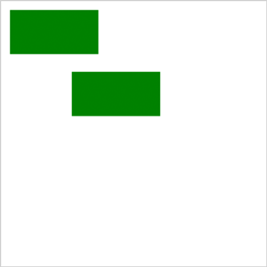

JavaScript：

```js
var c = document.getElementById('myCanvas');
var ctx = c.getContext('2d');

ctx.fillStyle = 'green';
ctx.fillRect(10, 10, 100, 50);
ctx.translate(70, 70);
ctx.fillRect(10, 10, 100, 50);
```

## 27. transform() 方法

`transform()` 允许您缩放、旋转、移动并倾斜当前的环境，且该变换只会影响 `transform()` 方法调用之后的绘图。

JavaScript 语法：

```js
context.transform(a, b, c, d, e, f);
```

参数值

- a 水平缩放绘图
- b 水平倾斜绘图
- c 垂直倾斜绘图
- d 垂直缩放绘图
- e 水平移动绘图
- f 垂直移动绘图

- 实例 17

绘制一个矩形；通过 transform() 添加一个新的变换矩阵，再次绘制矩形；添加一个新的变换矩阵，然后再次绘制矩形。请注意，每当您调用 transform() 时，它都会在前一个变换矩阵上构建：

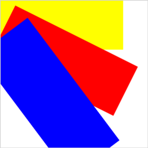

JavaScript：

```js
var canvas = document.getElementById('myCanvas');
var ctx = canvas.getContext('2d');

ctx.fillStyle = 'yellow';
ctx.fillRect(0, 0, 250, 100);

ctx.transform(1, 0.5, -0.5, 1, 30, 10);
ctx.fillStyle = 'red';
ctx.fillRect(0, 0, 250, 100);

ctx.transform(1, 0.5, -0.5, 1, 30, 10);
ctx.fillStyle = 'blue';
ctx.fillRect(0, 0, 250, 100);
```

## 28. setTransform() 方法

`setTransform()` 方法把当前的变换矩阵重置为单位矩阵，然后以相同的参数运行 `transform()`。

## 29. textAlign 属性

`textAlign` 属性根据锚点，设置或返回文本内容的当前对齐方式。

JavaScript 语法：

```js
context.textAlign = 'center|end|left|right|start';
```

属性值

- start，默认值，文本在指定的位置开始。
- end，文本在指定的位置结束。
- center，文本的中心被放置在指定的位置。
- left，文本左对齐。
- right，文本右对齐。

## 30. textBaseline 属性

`textBaseline` 属性设置或返回在绘制文本时的当前文本基线。

JavaScript 语法：

```js
context.textBaseline = 'alphabetic|top|hanging|middle|ideographic|bottom';
```

属性值

- alphabetic，默认值，文本基线是普通的字母基线。
- top，文本基线是 em 方框的顶端。。
- hanging，文本基线是悬挂基线。
- middle，文本基线是 em 方框的正中。
- ideographic，文本基线是表意基线。
- bottom，文本基线是 em 方框的底端。

## 31. fillText() 方法

`fillText()` 方法在画布上绘制填色的文本，文本的默认颜色是黑色。

JavaScript 语法：

```js
context.fillText(text, x, y, maxWidth);
```

参数值

- text，规定在画布上输出的文本。
- x，开始绘制文本的 x 坐标位置（相对于画布）。
- y，开始绘制文本的 y 坐标位置（相对于画布）。
- maxWidth，可选，允许的最大文本宽度，以像素计。

- 实例 18

使用 fillText()，在画布上写文本：


JavaScript：

```js
var canvas = document.getElementById('myCanvas');
var ctx = canvas.getContext('2d');

ctx.font = '20px Georgia';
ctx.fillText('Hello World!', 10, 50);

ctx.font = '20px Verdana';
// 创建渐变
var gradient = ctx.createLinearGradient(0, 0, canvas.width, 0);
gradient.addColorStop('0', 'magenta');
gradient.addColorStop('0.5', 'blue');
gradient.addColorStop('1.0', 'red');
// 用渐变填色
ctx.fillStyle = gradient;
ctx.fillText('guihua.pgh@alibaba-inc.com', 10, 90);
```

## 32. strokeText() 方法

`strokeText()` 方法在画布上绘制文本（没有填色），文本的默认颜色是黑色。

JavaScript 语法：

```js
context.strokeText(text, x, y, maxWidth);
```

## 33. measureText() 方法

`measureText()` 方法返回包含一个对象，该对象包含以像素计的指定字体宽度。

JavaScript 语法：

```js
context.measureText(text).width;
```

> 如果您需要在文本向画布输出之前，就了解文本的宽度，那么请使用该方法。

## 34. drawImage() 方法

`drawImage()` 方法在画布上绘制图像、画布或视频，也能够绘制图像的某些部分，以及/或者增加或减少图像的尺寸。

1. 在画布上定位图像：

```js
context.drawImage(img, x, y);
```

2. 在画布上定位图像，并规定图像的宽度和高度：

```js
context.drawImage(img, x, y, width, height);
```

3. 剪切图像，并在画布上定位被剪切的部分：

```js
context.drawImage(img, sx, sy, swidth, sheight, x, y, width, height);
```

参数值

- img：规定要使用的图像、画布或视频。
- sx：开始剪切的 x 坐标位置（可选）。
- sy：开始剪切的 y 坐标位置（可选）。
- swidth：被剪切图像的宽度（可选）。
- sheight：被剪切图像的高度（可选）。
- x：在画布上放置图像的 x 坐标位置。
- y：在画布上放置图像的 y 坐标位置。
- width：要使用的图像的宽度。（伸展或缩小图像）（可选）
- height：要使用的图像的高度。（伸展或缩小图像）（可选）

## 35. createImageData() 方法

`createImageData()` 方法创建新的空白 `ImageData` 对象。新对象的默认像素值 `transparent black`。

对于 ImageData 对象中的每个像素，都存在着四方面的信息，即 RGBA 值：

- R - 红色 (0-255)
- G - 绿色 (0-255)
- B - 蓝色 (0-255)
- A - alpha 通道 (0-255; 0 是透明的，255 是完全可见的)

因此 ，transparent black 表示 (0,0,0,0)。

color/alpha 以数组形式存在，并且既然数组包含了每个像素的四条信息，数组的大小是 ImageData 对象的四倍。（获得数组大小有更简单的办法，就是使用 ImageDataObject.data.length）。

JavaScript 语法：

```js
var imgData = context.createImageData(width, height);
```

实现案例：

```js
var canvas = document.getElementById('myCanvas');
var ctx = canvas.getContext('2d');

var imgData = ctx.createImageData(100, 100);

for (var i = 0; i < imgData.data.length; i += 4) {
  imgData.data[i + 0] = 255;
  imgData.data[i + 1] = 0;
  imgData.data[i + 2] = 0;
  imgData.data[i + 3] = 255;
}

ctx.putImageData(imgData, 10, 10);
```

## 36. getImageData() 方法

`getImageData()` 方法返回 `ImageData` 对象，该对象拷贝了画布指定矩形的像素数据。

对于 ImageData 对象中的每个像素，都存在着四方面的信息，即 RGBA 值：

- R - 红色 (0-255)
- G - 绿色 (0-255)
- B - 蓝色 (0-255)
- A - alpha 通道 (0-255; 0 是透明的，255 是完全可见的)

`color/alpha` 以数组形式存在，并存储于 `ImageData` 对象的 `data` 属性中。

> 在操作完成数组中的 `color/alpha` 信息之后，您可以使用 `putImageData()` 方法将图像数据拷贝回画布上。

JavaScript 语法

```js
var imgData = context.getImageData(x, y, width, height);
```

以下代码可获得被返回的 ImageData 对象中第一个像素的 color/alpha 信息：

```js
red = imgData.data[0];
green = imgData.data[1];
blue = imgData.data[2];
alpha = imgData.data[3];
```

> 也可以使用 getImageData() 方法来反转画布上某个图像的每个像素的颜色。

使用该公式遍历所有的像素，并改变其颜色值：

```js
red = 255 - old_red;
green = 255 - old_green;
blue = 255 - old_blue;
```

## 37. putImageData() 方法

`putImageData()` 方法将图像数据（从指定的 `ImageData` 对象）放回画布上。

JavaScript 语法：

```js
context.putImageData(imgData, x, y, dirtyX, dirtyY, dirtyWidth, dirtyHeight);
```

参数值

- imgData：规定要放回画布的 ImageData 对象。
- x：ImageData 对象左上角的 x 坐标，以像素计。
- y：ImageData 对象左上角的 y 坐标，以像素计。
- dirtyX：水平值（x），以像素计，在画布上放置图像的位置（可选）。
- dirtyY：水平值（y），以像素计，在画布上放置图像的位置（可选）。
- dirtyWidth：在画布上绘制图像所使用的宽度（可选）。
- dirtyHeight：在画布上绘制图像所使用的高度（可选）。

- 实例 19

JavaScript：

```js
var c = document.getElementById('myCanvas');
var ctx = c.getContext('2d');

var img = document.getElementById('tulip');
ctx.drawImage(img, 0, 0);

var imgData = ctx.getImageData(0, 0, c.width, c.height);

// 反转颜色
for (var i = 0; i < imgData.data.length; i += 4) {
  imgData.data[i] = 255 - imgData.data[i];
  imgData.data[i + 1] = 255 - imgData.data[i + 1];
  imgData.data[i + 2] = 255 - imgData.data[i + 2];
  imgData.data[i + 3] = 255;
}

ctx.putImageData(imgData, 0, 0);
```
